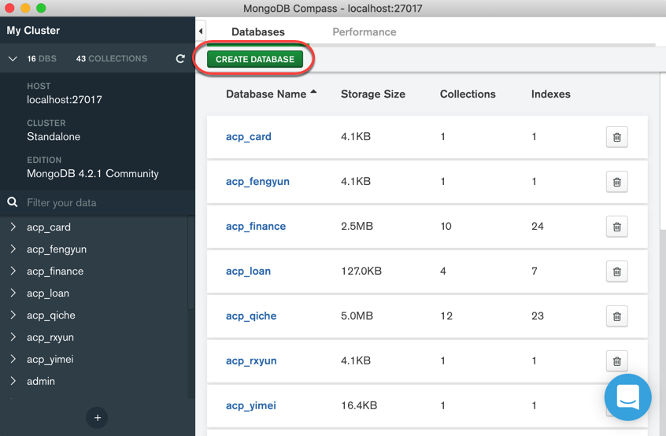
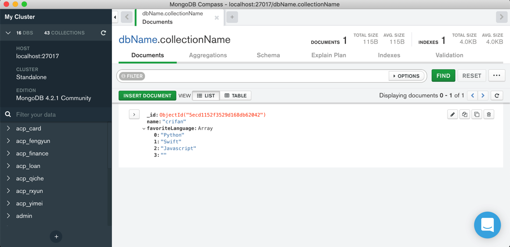

# 基本操作

## 创建数据库 + 创建集合 + 写入数据

### mongo shell

举例：


过程解释：

直接`use crifanDemo`

```bash
> use crifanDemo
switched to db crifanDemo
```

即可创建新的数据库`crifanDemo`

```bash
> db
crifanDemo
```

用`db`查看当前所在数据库

后续用：

```bash
> db.crifanDemo.insertOne({"name": "crifan"});
{
	"acknowledged" : true,
	"insertedId" : ObjectId("5ecd08641d1e7cfaa2e1051f")
}
```

去真正写入数据，才会真正（自动）创建一个`database`。

然后再去确认数据的确已经写入，可以用`find`去查找当前所有数据

在输入了`db.crifanDemo.find`，再按`Tab`键，则可以自动匹配出相关命令：

```bash
> db.crifanDemo.find
db.crifanDemo.find(               db.crifanDemo.findOne(            db.crifanDemo.findOneAndReplace(
db.crifanDemo.findAndModify(      db.crifanDemo.findOneAndDelete(   db.crifanDemo.findOneAndUpdate(
```

然后用`find`可以找出当前的所有的数据：

```bash
> db.crifanDemo.find()
{ "_id" : ObjectId("5ecd08641d1e7cfaa2e1051f"), "name" : "crifan" }
```

再去新增一条数据：

```bash
> db.crifanDemo.insertOne({"company": "fibodt"});
{
	"acknowledged" : true,
	"insertedId" : ObjectId("5ecd08831d1e7cfaa2e10520")
}
```

再去`find`即可看到数据的确增加到2条了：

```bash
> db.crifanDemo.find()
{ "_id" : ObjectId("5ecd08641d1e7cfaa2e1051f"), "name" : "crifan" }
{ "_id" : ObjectId("5ecd08831d1e7cfaa2e10520"), "company" : "fibodt" }
```

`find`也支持参数查找，比如：

```bash
> db.crifanDemo.find({"name": "crifan"})
{ "_id" : ObjectId("5ecd08641d1e7cfaa2e1051f"), "name" : "crifan" }
```

以及支持更多其他高级用法，比如搜索条件支持正则：

```bash
> db.crifanDemo.find({"name": {$regex: "cri"}})
{ "_id" : ObjectId("5ecd08641d1e7cfaa2e1051f"), "name" : "crifan" }
```

更多数据查询和用法，详见后面章节：

[高级搜索](https://book.crifan.com/books/popular_document_db_mongodb/website/summary_note/advance_research.html)

### MongoDB Compass

#### 创建数据库和集合




#### 写入数据

点击`INSERT DOCUMENT`：


会出现编辑数据的弹框：


输入对应的数据的`key`和`value`，如果想要新增字段，则点击左边的 `加号` ➕，会弹出 `Add Field after xxx`：


数据的类型，除了默认的`String`，还支持其他类型，比如`Array`数组：


分别输入数组的每项的值后，点击`INSERT`：


即可返回列表页，看到刚插入的数据：



## 删除数据库

* GUI工具
  * MongoDB Compass
    * 
* 命令行

```bash
> db.dropDatabase()
{ "dropped" : "storybook", "ok" : 1 }
```
