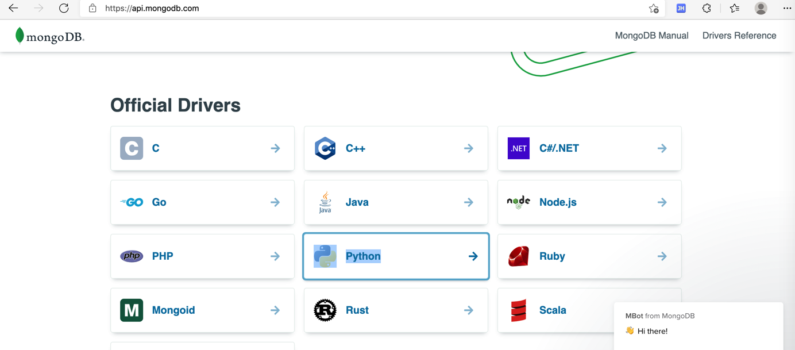

# PyMongo

用Python通过API操作的MongoDB，最常见的库是：`PyMongo`

## 基本使用

运行服务端：

```bash
mongod
```

代码中导入

```python
import pymongo
```

连接Client

```python
from pymongo import MongoClient
client = MongoClient()
```

如果需要，可以指定host和port：

```python
client = MongoClient('localhost', 27017)
```

或者通过`URI`指定更多参数：

```python
client = MongoClient('mongodb://localhost:27017/')
```

创建数据库：

```python
db = client.test_database
```

也可以用字典属性方式访问数据库：

```python
db = client['test-database']
```

访问集合：

```python
collection = db.test_collection
```

也可以用字典属性方式访问集合：

```python
collection = db['test-collection']
```

然后就可以正常操作了。

比如：插入（文档）数据

```python
demoDict = {"name": "Crifan"}
new_doc_id = collection.insert_one(demoDict).inserted_id
print("new_doc_id=%s" % new_doc_id)
```

更多基本操作用法可官网教程：

[Tutorial — PyMongo 3.12.0 documentation](https://pymongo.readthedocs.io/en/stable/tutorial.html)

## 资料

* 官网
  * MongoDB官网
    * [MongoDB Python Drivers — MongoDB Drivers](https://docs.mongodb.com/drivers/python/)
      * 图
        * 
      * PyMongo教程
        * [PyMongo — MongoDB Drivers](https://docs.mongodb.com/drivers/pymongo/)
      * 相关
        * [Motor (Async Driver) — MongoDB Drivers](https://docs.mongodb.com/drivers/motor/)
  * readthedocs.io
    * 版本：`>= 3.10`
      * [PyMongo 3.12.0 Documentation — PyMongo 3.12.0 documentation](https://pymongo.readthedocs.io/en/stable/index.html)
        * [Tutorial — PyMongo 3.12.0 documentation](https://pymongo.readthedocs.io/en/stable/tutorial.html)
        * [API Documentation — PyMongo 3.12.0 documentation](https://pymongo.readthedocs.io/en/stable/api/index.html)
* 第三方
  * [nummy/pymongo-tutorial-cn: pymongo中文教程](https://github.com/nummy/pymongo-tutorial-cn)
