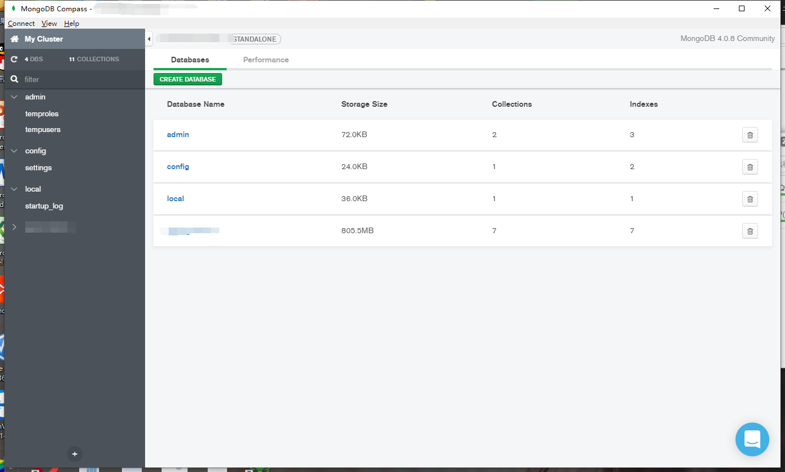
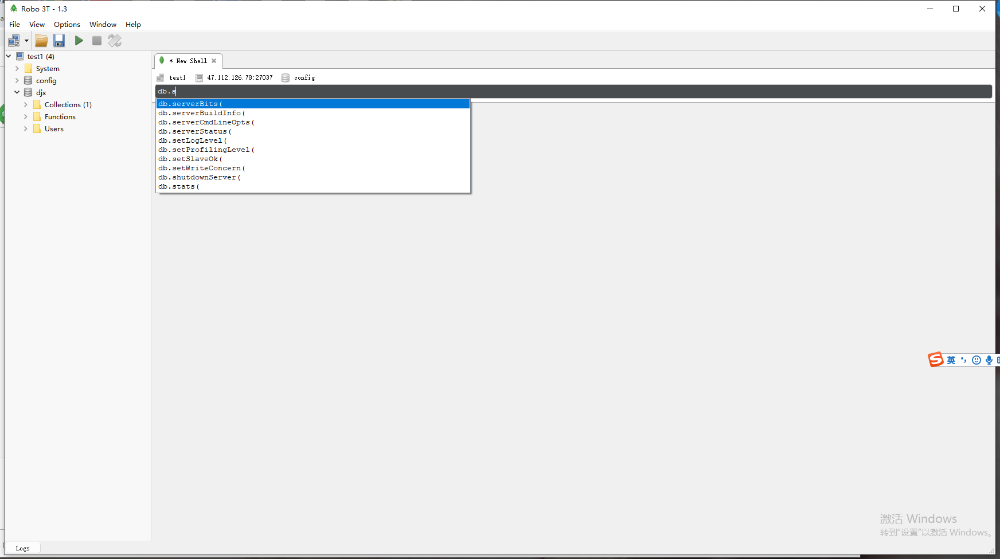
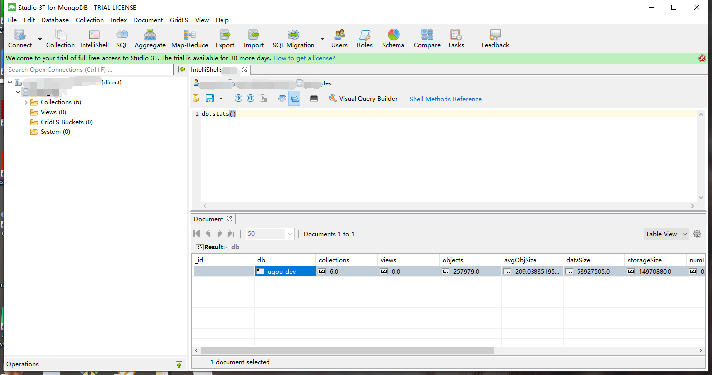
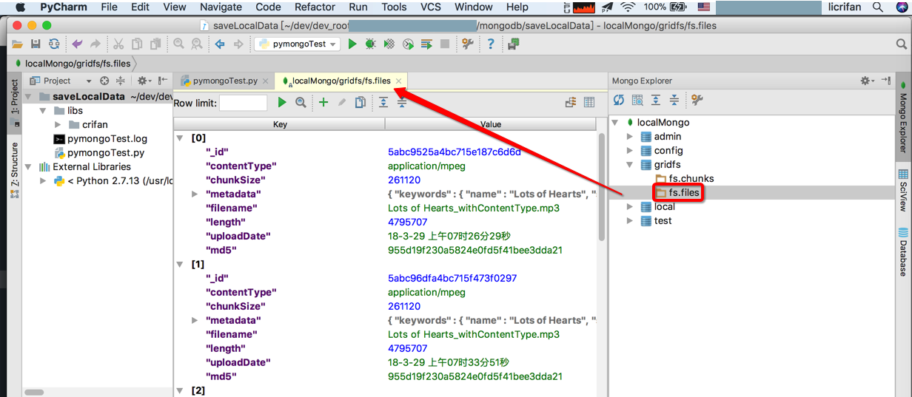
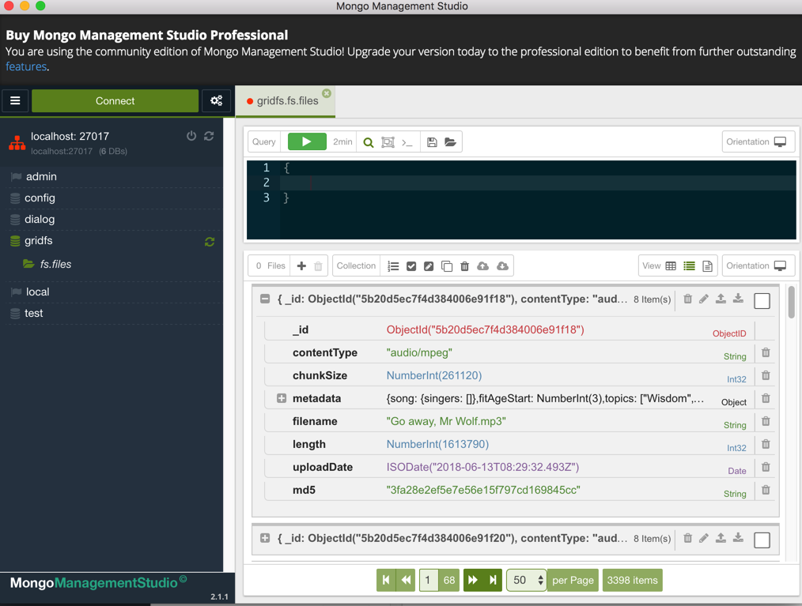
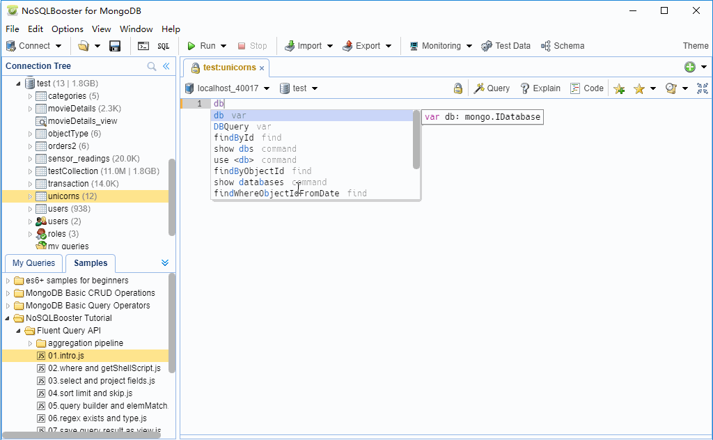

# GUI工具

* `MongoDB Compass`
  * Logo
    * 
  * 特点
    * 官方出品
    * 免费
    * 颜值高
    * 功能够用
  * 截图
    * 
  * 官网
    * [MongoDB Compass — MongoDB Compass stable](https://docs.mongodb.com/compass/current/)
* `Robot 3T`
  * 旧称：`Robomongo`
  * Logo
    * 
  * 特点
    * 免费
    * 功能够用
  * 截图
    * 
  * 官网
    * [Robo 3T | Free, open-source MongoDB GUI (formerly Robomongo)](https://robomongo.org)
  * 同一家公司的另外一款收费版
    * `Studio 3T`
      * 截图
        * 
      * 官网
        * [The Professional GUI, IDE & Client for MongoDB | Studio 3T](https://studio3t.com)
* `mongo4idea`
  * PyCharm的MongoDB的插件
  * 截图
    * 
  * 官网
    * Github
      * [dboissier/mongo4idea: MongoDB integration in Intellij](https://github.com/dboissier/mongo4idea)
* `MMS`=`Mongo Management Studio`
  * 截图
    * 
  * 特点
    * 号称支持`GridFS`
      * 但是支持的不完美
        * 不支持写入
  * 官网
    * [Mongo Management Studio - the professional MongoDB GUI](http://mms.litixsoft.de)
* `NoSQLBooster`
  * 有免费版
    * 也有收费版
  * 截图
    * 
* 其他
  * [VSCode](https://book.crifan.com/books/best_editor_vscode/website/)支持[MongoDB](https://code.visualstudio.com/docs/azure/mongodb)

## 部分对比

### Robot 3T vs Studio 3T

* Studio 3T
  * Migrate databases & relations between SQL & MongoDB
  * Auto-complete queries with IntelliShell
  * Drag & drop fields to visually build queries
  * Use SQL to query MongoDB
  * Build aggregation queries stage by stage
  * Generate driver code in 6 languages
  * Automate repetitive MongoDB tasks like imports
  * And so much more...
* Robo 3T
  * For simple tasks
  * Embedded shell
  * Lightweight & fun
