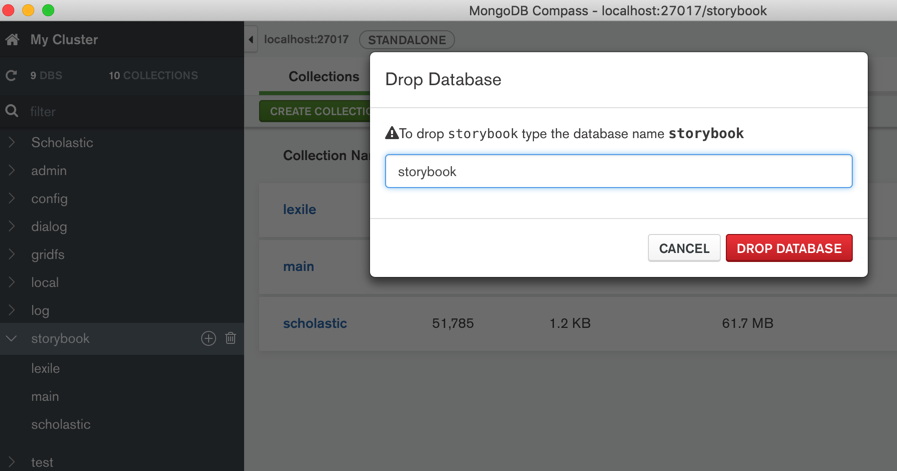

# MongoDB Compass

TODO:

* [【已解决】MongoDB Compass中如何快速高效地刷新数据](http://www.crifan.com/mongo_compass_fast_effective_reload_refresh_latest_data%0A)

## 下载和安装MongoDB Compass

根据官网介绍

[Download and Install Compass — MongoDB Compass stable](https://docs.mongodb.com/compass/master/install/)

去下载页面

[Compass | MongoDB](https://www.mongodb.com/products/compass)

下载安装包

比如Mac的是

https://downloads.mongodb.com/compass/mongodb-compass-1.14.5-darwin-x64.dmg

下载后，安装即可。安装后是：

当前版本是：`1.14.5`

## 基本使用

打开后，进入连接数据库页：

点击连接后，进入数据库列表页：

### 创建数据库和集合

### 写入数据

点击`INSERT DOCUMENT`：

会出现编辑数据的弹框：

输入对应的数据的`key`和`value`，如果想要新增字段，则点击左边的 `加号` ➕，会弹出 `Add Field after xxx`：

数据的类型，除了默认的`String`，还支持其他类型，比如`Array`数组：

分别输入数组的每项的值后，点击`INSERT`：

即可返回列表页，看到刚插入的数据：

### 删除数据库

## 好用之处

### 直接编辑内容

截图举例：

### 字段可以很方便的折叠和展开

点击每条记录前面的箭头：

即可展开所有字段：

再次点击，即可缩回。

## 其他实际使用效果举例

## 功能特性介绍=引导页

引导页有截图介绍其好用的功能和特点，供参考：

### Perfromance Charts

### Sidebar Redesigned

### Visualize your Schema

### Build Geo Queries

### Interactive Document Editor

### Visual Explain Plains

### Index Management

### Document Validation

### Improved CURD

### Deployment Awareness

### Query History

