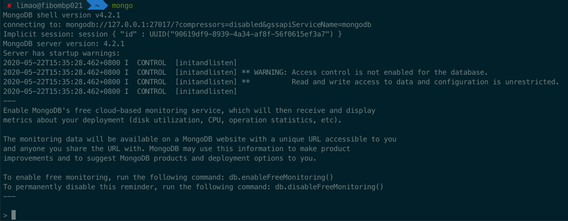

# 命令行shell

MongoDB在安装后，自带`mongo shell`，是个交互式终端。可以在里面以命令行方式操作数据库。


> #### info::最新版需要单独安装shell
> 最新的社区免费版mongodb-community的shell需要单独安装
> 
> `brew install mongodb-community-shell`

## 启动mongo shell

在命令行中输入

```bash
mongo
```

回车后，即可进入shell界面：



## 基本语法

### 切换到想要进入的数据库

```bash
use dbToSwitch
```

举例：

```bash
> use log
switched to db log
```

### 确认当前所在是哪个数据库

语法：

```bash
db
```

举例：

```bash
> db
admin
```

和

```bash
> db
log
```

### 新建用户

在创建新用户之前，先要用有权限的用户，比如 `admin` 登录进去，才能有权限创建新用户

注：此处之前已创建过`admin`超级用户，所以先去登录进入

```bash
mongo --host localhost --port 32018 -u root -p P@w --authenticationDatabase admin
```

然后再去给还没创建的新数据库去创建新用户

需要先去切换到对应的（虽然此时还不存在的）新的数据库：

```bash
use newDbName
```

然后才能（在当前数据库下）创建新用户：

```bash
db.createUser({
  user: "newUserName",
  pwd: "yourPassword",
  roles: [ { role: "dbOwner", db: "newDbName" } ]
})
```

然后可以确认一下是否创建成功：

```bash
show users
```

即可看到新创建的用户。

## 举例

### 创建数据库并新增数据

举例：


过程解释：

直接`use crifanDemo`

```bash
> use crifanDemo
switched to db crifanDemo
```

即可创建新的数据库`crifanDemo`

```bash
> db
crifanDemo
```

用`db`查看当前所在数据库

后续用：

```bash
> db.crifanDemo.insertOne({"name": "crifan"});
{
	"acknowledged" : true,
	"insertedId" : ObjectId("5ecd08641d1e7cfaa2e1051f")
}
```

去真正写入数据，才会真正（自动）创建一个`database`。

然后再去确认数据的确已经写入，可以用`find`去查找当前所有数据

在输入了`db.crifanDemo.find`，再按`Tab`键，则可以自动匹配出相关命令：

```bash
> db.crifanDemo.find
db.crifanDemo.find(               db.crifanDemo.findOne(            db.crifanDemo.findOneAndReplace(
db.crifanDemo.findAndModify(      db.crifanDemo.findOneAndDelete(   db.crifanDemo.findOneAndUpdate(
```

然后用`find`可以找出当前的所有的数据：

```bash
> db.crifanDemo.find()
{ "_id" : ObjectId("5ecd08641d1e7cfaa2e1051f"), "name" : "crifan" }
```

再去新增一条数据：

```bash
> db.crifanDemo.insertOne({"company": "company_name"});
{
	"acknowledged" : true,
	"insertedId" : ObjectId("5ecd08831d1e7cfaa2e10520")
}
```

再去`find`即可看到数据的确增加到2条了：

```bash
> db.crifanDemo.find()
{ "_id" : ObjectId("5ecd08641d1e7cfaa2e1051f"), "name" : "crifan" }
{ "_id" : ObjectId("5ecd08831d1e7cfaa2e10520"), "company" : "company_name" }
```

`find`也支持参数查找，比如：

```bash
> db.crifanDemo.find({"name": "crifan"})
{ "_id" : ObjectId("5ecd08641d1e7cfaa2e1051f"), "name" : "crifan" }
```

以及支持更多其他高级用法，比如搜索条件支持正则：

```bash
> db.crifanDemo.find({"name": {$regex: "cri"}})
{ "_id" : ObjectId("5ecd08641d1e7cfaa2e1051f"), "name" : "crifan" }
```

更多数据查询和用法，详见后面章节：

[高级搜索](https://book.crifan.com/books/popular_document_db_mongodb/website/summary_note/advance_research.html)


### 想要给新的暂时还不存在的数据库log中创建用户log

具体过程是：

```bash
> use log
switched to db log
> db.createUser({
...   user: "log",
...   pwd: "NL2@18Log",
...   roles: [ { role: "dbOwner", db: "log" } ]
... })
Successfully added user: {
        "user" : "log",
        "roles" : [
                {
                        "role" : "dbOwner",
                        "db" : "log"
                }
        ]
}
> show users
{
        "_id" : "log.log",
        "user" : "log",
        "db" : "log",
        "roles" : [
                {
                        "role" : "dbOwner",
                        "db" : "log"
                }
        ]
}
```

### 清空旧用户创建新用户

查看（当前数据库的）用户：

```bash
show users;
```

举例

```bash
> use admin
switched to db admin
> show users
{
    "_id" : "admin.root",
    "user" : "root",
    "db" : "admin",
    "roles" : [
        {
            "role" : "root",
            "db" : "admin"
        }
    ]
}
> use gridfs
```

创建用户：

* 切换到amind数据库
* 清除掉admin的之前其他用户
* 创建一个叫root的，角色是root的用户（拥有超级管理员，操作任意其他数据库的权限）

```bash
> use admin
switched to db admin
> db.runCommand({dropAllUsersFromDatabase: 1})
{ "n" : 1, "ok" : 1 }
> db.createUser({
...     user: "root",
...     pwd: "pwd",
...     roles: [ { role: "root", db: "admin" } ]
... })
Successfully added user: {
        "user" : "root",
        "roles" : [
                {
                        "role" : "root",
                        "db" : "admin"
                }
        ]
}
> show users
{
        "_id" : "admin.root",
        "user" : "root",
        "db" : "admin",
        "roles" : [
                {
                        "role" : "root",
                        "db" : "admin"
                }
        ]
}
```

### 查看当前用户

```bash
show users
```

举例：

```bash
> show users
{
        "_id" : "admin.root",
        "user" : "root",
        "db" : "admin",
        "roles" : [
                {
                        "role" : "root",
                        "db" : "admin"
                }
        ]
}
```

### 删除用户

语法：

```bash
db.dropUser("userToDelete")
```

举例：

```bash
> db.dropUser("log")
true
```

### 删除数据库

```bash
> db.dropDatabase()
{ "dropped" : "storybook", "ok" : 1 }
```

### 从GridFS中找歌曲类型的文件

```bash
> db.fs.files.find({"metadata.resourceType": "song"}).limit(2).pretty()
{
    "_id" : ObjectId("5b21d3787f4d384d04543f6e"),
    "contentType" : "audio/x-ms-wma",
    "chunkSize" : 261120,
    "metadata" : {
        "song" : {
            "singers" : [ ]
        },
        "fitAgeStart" : 2,
        "topics" : [
            "Fingerplay",
            "Animal",
            "Weather"
        ],
        "storybook" : {
            "publisher" : "",
            "isFiction" : "",
            "lexileIndex" : "",
            "awards" : "",
            "authors" : [ ],
            "foreignCountry" : ""
        },
        "keywords" : {
            "fromName" : [
                "animal animal",
                "animal"
            ],
            "other" : [
                "Sun",
                "Rain",
                "water spout"
            ],
            "fromContent" : [ ]
        },
        "name" : "Animals, Animals",
        "resourceType" : "song",
        "mainActors" : [
            "Spider"
        ],
        "contentAbstract" : "",
        "isSeries" : true,
        "series" : {
            "number" : 1,
            "name" : "Wee Sing-Animals, Animals, Animals"
        },
        "fitAgeEnd" : 6,
        "fileInfo" : {
            "isAudio" : true,
            "contentType" : "audio/x-ms-wma",
            "name" : "Animals, Animals.wma",
            "suffix" : "wma"
        }
    },
    "filename" : "Animals, Animals.wma",
    "length" : 2277430,
    "uploadDate" : ISODate("2018-06-14T02:31:20.767Z"),
    "md5" : "b334806c280cc37c4b873a8e2a2086cd"
}
{
    "_id" : ObjectId("5b21d3787f4d384d04543f78"),
    "contentType" : "audio/x-ms-wma",
    "chunkSize" : 261120,
    "metadata" : {
        "song" : {
            "singers" : [ ]
        },
        "fitAgeStart" : 2,
        "topics" : [
            "Fingerplay",
            "Family",
            "Others"
        ],
        "storybook" : {
            "publisher" : "",
            "isFiction" : "",
            "lexileIndex" : "",
            "awards" : "",
            "authors" : [ ],
            "foreignCountry" : ""
        },
        "keywords" : {
            "fromName" : [
                "old macdonald",
                "old Macdonald farm"
            ],
            "other" : [
                "knives",
                "forks",
                "mirror",
                "table",
                "looking glass",
                "cradle"
            ],
            "fromContent" : [ ]
        },
        "name" : "Old Macdonald Had a Farm",
        "resourceType" : "song",
        "mainActors" : [
            "mother",
            "baby"
        ],
        "contentAbstract" : "",
        "isSeries" : true,
        "series" : {
            "number" : 2,
            "name" : "Wee Sing-Animals, Animals, Animals"
        },
        "fitAgeEnd" : 6,
        "fileInfo" : {
            "isAudio" : true,
            "contentType" : "audio/x-ms-wma",
            "name" : "Old Macdonald Had a Farm.wma",
            "suffix" : "wma"
        }
    },
    "filename" : "Old Macdonald Had a Farm.wma",
    "length" : 1924864,
    "uploadDate" : ISODate("2018-06-14T02:31:21.192Z"),
    "md5" : "a2b65c25d117d428beaa346b0b7e232f"
}
```

### 统计歌曲类型文件总数

```bash
> db.fs.files.find({"metadata.resourceType": "song", "metadata.fileInfo.suffix": "mp3"}).count()
378
> db.fs.files.find({"metadata.resourceType": "song", "metadata.fileInfo.suffix": "wma"}).count()
523
> db.fs.files.find({"metadata.resourceType": "song"}).count()
901
```
