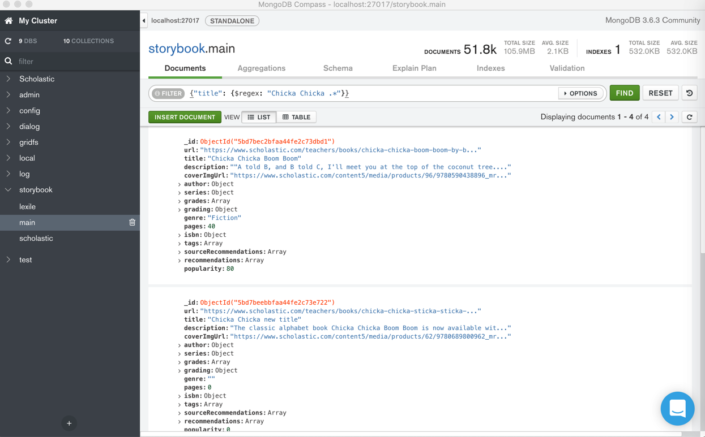

# 心得和总结

下面总结一些在MongoDB使用期间的心得和注意事项等内容。

先列出一些小的心得

## 导入数据之前，确保ID不能重复，否则会由于ID重复而无法覆盖

之前某次去恢复数据，故意没有删除本地之前已有（同样但是旧的）数据：



看看导入能否直接覆盖，结果由于ID重复而报错，覆盖失败：

```bash
  - E11000 duplicate key error collection: storybook.main index: _id_ dup key: { : ObjectId('5bd7be33bfaa44fe2c73bda2') }

^C2018-12-06T11:02:12.531+0800    signal 'interrupt' received; attempting to shut down
2018-12-06T11:02:12.560+0800    error: multiple errors in bulk operation:
  - E11000 duplicate key error collection: storybook.scholastic index: _id_ dup key: { : ObjectId('5bc71849bfaa4425b7ea8082') }
  - E11000 duplicate key error collection: storybook.scholastic index: _id_ dup key: { : ObjectId('5bc7184dbfaa4425b7ea8083') }
  - E11000 duplicate key error collection: storybook.scholastic index: _id_ dup key: { : ObjectId('5bc7184dbfaa4425b7ea8084') }
```
