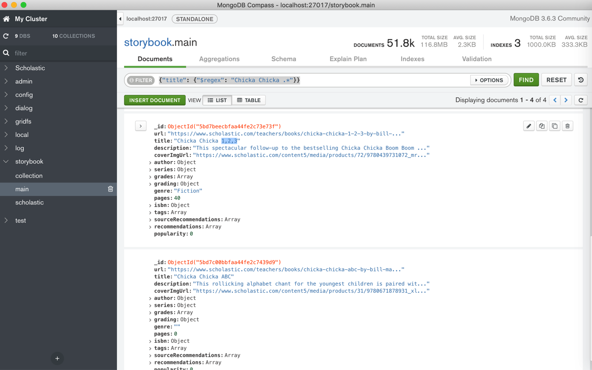
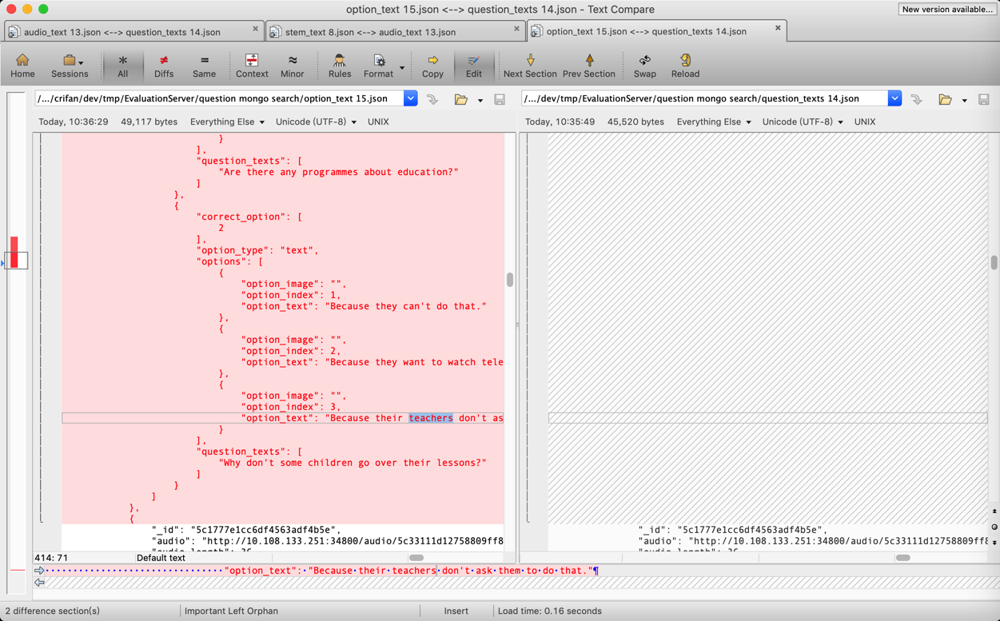

# 高级搜索

下面介绍在搜索和查询想要的记录时，涉及到的一些高级搜索技巧，尤其是正则搜索和嵌套搜索。

## 搜索期间的条件组合

背景：搜索数据期间，可能会用到多种条件，不同条件，可能需要组合在一起。

对于组合的种类和语法，详见官网：

[Operators — MongoDB Manual](https://docs.mongodb.com/manual/reference/operator/)

->

[Query and Projection Operators — MongoDB Manual](https://docs.mongodb.com/manual/reference/operator/query/)

先列出有哪些类型：

* Comparison
  * $eq
    * Matches values that are equal to a specified value.
  * $gt
    * Matches values that are greater than a specified value.
  * $gte
    * Matches values that are greater than or equal to a specified value.
  * $in
    * Matches any of the values specified in an array.
  * $lt
    * Matches values that are less than a specified value.
  * $lte
    * Matches values that are less than or equal to a specified value.
  * $ne
    * Matches all values that are not equal to a specified value.
  * $nin
    * Matches none of the values specified in an array.
* Logical
  * $and
    * Joins query clauses with a logical AND returns all documents that match the conditions of both clauses.
  * $not
    * Inverts the effect of a query expression and returns documents that do not match the query expression.
  * $nor
    * Joins query clauses with a logical NOR returns all documents that fail to match both clauses.
  * $or
    * Joins query clauses with a logical OR returns all documents that match the conditions of either clause.
* Element
  * $exists
    * Matches documents that have the specified field.
  * $type
    * Selects documents if a field is of the specified type.
* Evaluation
  * $expr
    * Allows use of aggregation expressions within the query language.
  * $jsonSchema
    * Validate documents against the given JSON Schema.
  * $mod
    * Performs a modulo operation on the value of a field and selects documents with a specified result.
  * $regex
    * Selects documents where values match a specified regular expression.
  * $text
    * Performs text search.
  * $where
    * Matches documents that satisfy a JavaScript expression.
* Geospatial
  * $geoIntersects
    * Selects geometries that intersect with a GeoJSON geometry. The 2dsphere index supports$geoIntersects.
  * $geoWithin
    * Selects geometries within a bounding GeoJSON geometry. The 2dsphere and 2d indexes support $geoWithin.
  * $near
    * Returns geospatial objects in proximity to a point. Requires a geospatial index. The 2dsphereand 2d indexes support $near.
  * $nearSphere
    * Returns geospatial objects in proximity to a point on a sphere. Requires a geospatial index. The 2dsphere and 2d indexes support $nearSphere.
* Array
  * $all
    * Matches arrays that contain all elements specified in the query.
  * $elemMatch
    * Selects documents if element in the array field matches all the specified $elemMatch conditions.
  * $size
    * Selects documents if the array field is a specified size.
* Bitwise
  * $bitsAllClear
    * Matches numeric or binary values in which a set of bit positions all have a value of 0.
  * $bitsAllSet
    * Matches numeric or binary values in which a set of bit positions all have a value of 1.
  * $bitsAnyClear
    * Matches numeric or binary values in which any bit from a set of bit positions has a value of 0.
  * $bitsAnySet
    * Matches numeric or binary values in which any bit from a set of bit positions has a value of 1.
* Comments
  * $comment
    * Adds a comment to a query predicate.
* Projection Operators
  * $
    * Projects the first element in an array that matches the query condition.
  * $elemMatch
    * Projects the first element in an array that matches the specified $elemMatch condition.
  * $meta
    * Projects the document’s score assigned during $text operation.
  * $slice
    * Limits the number of elements projected from an array. Supports skip and limit slices.

可以根据需要选择合适的组合方式。

举例：

```bash
db.inventory.find( { $or: [ { quantity: { $lt: 20 } }, { price: 10 } ] } )
```

和：

```bash
var cursor = db.collection('inventory').find({ 
  $or: [ {status: "A" }, { qty: { $lt: 30 } } ]
});
```

## 列表子元素搜索

如果是搜索list中所有的元素，即不关心list中具体是第几个元素，那么就直接写成：

```bash
mainField.subFieldList
```

如果要关心具体是哪个位置的元素的值，则使用：`.N`

比如 第一个是

```bash
mainField.subFieldList.0
```

而更加复杂的组合，可以用到：
* `$size`
    * 表示list的个数
* `$all`
    * 表示所有的
* `$elemMatch`

即可。

更多语法细节可参考：

[Array Query Operators — MongoDB Manual](https://docs.mongodb.com/manual/reference/operator/query-array/)

## 字段嵌套搜索

用 **点** `.` 实现字段的嵌套的搜索：

## 举例：搜索子字段sub_questions的options的option_text

对于内容：

```json
{
  "_id": "5c1777e1cc6df4563adf4a5c",
  "max_answer_time": 20,
  "audio": "5c33111d12758809ff867931",
  "stem_type": "mix",
  "sub_questions": [{
    "option_type": "text",
    "correct_option": [3],
    "question_texts": [""],
    "options": [{
      "option_index": 1,
      "option_text": "lean",
      "option_image": ""
    }, {
      "option_index": 2,
      "option_text": "less",
      "option_image": ""
    }, {
      "option_index": 3,
      "option_text": "lesson",
      "option_image": ""
    }]
  }],
。。。
```

想要通过子字段`sub_questions`的`options`的`option_text`之类的嵌套字段去搜索

写成：

```bash
sub_questions.options.option_text
```

即可。

## 支持正则查询

举例：

### MongoDB Compass

#### 举例：搜索AD开头的lexile

MongoDB Compass中，想要用正则搜索字段：

```bash
grading
    lexile: "AD450L"
```

写法是：

```bash
{"grading.lexile": {$regex: "AD.*"}}
```

或：regex加上行首和行尾判断：

```bash
{"grading.lexile": {$regex: "^AD.*$"}}
```

或 regex用引号引起来

```bash
{"grading.lexile": {"$regex": "AD.*"}}
```

注：

另外试了试：

```bash
{"grading.lexile": {$regex: "^AD\d+.*$"}}
```

发现搜索不到，所以结论是：此处正则搜索不支持`\d`数字


#### 举例：用正则语法去搜索title

`{"title": {"$regex": "Chicka Chicka .*"}}`

可以搜到匹配的多个数据：



#### 举例：多个字段同时正则搜索+嵌套搜索+列表字段搜索

此处去实现一个更加复杂的：

* 正则搜索
* 多个条件组合搜索
* 字段嵌套搜索
* 列表字段搜索

要搜索的内容：

```json
{
    "_id": "5c1777e1cc6df4563adf4b3c",
    "audio": "http://10.108.133.251:34800/audio/5c33111e12758809ff867a5e/238.mp3",
    "audio_length": 29,
    "audio_text": "f: Hi. I’m Tania. What’s your name? m: Hello. My name’s Jing. f: Nice to meet you, Jing. What class are you in? m: I’m in class 1B. And you? f: Me too. I’m in Class 1B too. m: Who’s our teacher? f: Mr Smith. m: And where’s our classroom? f: This way. Come with me. m: OK. Great.",
    "ave_answer_time": 70,
    "checkpoint": [
        73,
        83,
        "对话和应答"
    ],
    "difficulty": 3.2,
    "major_type": "单选多题",
    "max_answer_time": 140,
    "question_number": 238,
    "stem_image": "http://10.108.133.251:34800/image/5c32f6b012758802476f7f9d/school.png",
    "stem_text": "",
    "stem_type": "mix",
    "sub_questions": [
        {
            "correct_option": [
                1
            ],
            "option_type": "text",
            "options": [
                {
                    "option_image": "",
                    "option_index": 1,
                    "option_text": "Yes"
                },
                {
                    "option_image": "",
                    "option_index": 2,
                    "option_text": "No"
                }
            ],
            "question_texts": [
                "Jing and Tania are in the same class."
            ]
        },
        {
            "correct_option": [
                1
            ],
            "option_type": "text",
            "options": [
                {
                    "option_image": "",
                    "option_index": 1,
                    "option_text": "Yes"
                },
                {
                    "option_image": "",
                    "option_index": 2,
                    "option_text": "No"
                }
            ],
            "question_texts": [
                "Their teacher is a man."
            ]
        },
        {
            "correct_option": [
                2
            ],
            "option_type": "text",
            "options": [
                {
                    "option_image": "",
                    "option_index": 1,
                    "option_text": "Yes"
                },
                {
                    "option_image": "",
                    "option_index": 2,
                    "option_text": "No"
                }
            ],
            "question_texts": [
                "Jing knows where the classroom is."
            ]
        }
    ]
},
```

想要搜索字段：
* stem_text
* audio_text
* sub_questions的question_texts（这个列表）中的任何一个
* sub_questions的options（这个列表中的）任何一个的option_text

包含了teacher的话

则搜索条件可以写成：

```bash
{
  '$or': [{
      'stem_text': {
        '$regex': 'teacher',
        '$options': 'im'
      }
    },
    {
      'audio_text': {
        '$regex': 'teacher',
        '$options': 'im'
      }
    },
    {
      'sub_questions.question_texts': {
        '$regex': 'teacher',
        '$options': 'im'
      }
    },
    {
      'sub_questions.options.option_text': {
        '$regex': 'teacher',
        '$options': 'im'
      }
    }
  ]
}
```

对应代码：

```python
          findParam["$or"] = [
              {"stem_text": {"$regex": searchText, "$options": "im"}},
              {"audio_text": {"$regex": searchText, "$options": "im"}},
              {"sub_questions.question_texts": {"$regex": searchText, "$options": "im"}},
              {"sub_questions.options.option_text": {"$regex": searchText, "$options": "im"}},
          ]
```

相关部分完整代码：

```python
      findParam = {}

      searchText = parsedArgs["searchText"]
      if searchText:
          findParam["$or"] = [
              {"stem_text": {"$regex": searchText, "$options": "im"}},
              {"audio_text": {"$regex": searchText, "$options": "im"}},
              {"sub_questions.question_texts": {"$regex": searchText, "$options": "im"}},
              {"sub_questions.options.option_text": {"$regex": searchText, "$options": "im"}},
          ]

      majorType = parsedArgs["majorType"]
      if majorType:
          findParam["major_type"] = majorType

      sortBy = "question_number"
      log.debug("findParam=%s", findParam)
      sortedQuestionsCursor = questionCollection.find(findParam).sort(sortBy, pymongo.ASCENDING)
      totalCount = sortedQuestionsCursor.count()
```

即可搜索到要的内容：



#### 举例：搜索题干类型题目中包含teach的题目

举例另一个复杂的例子：

代码：

```python
findParam = {}

majorType = parsedArgs["majorType"]
if majorType:
    findParam["major_type"] = majorType

stemType = parsedArgs["stemType"]
if stemType:
    findParam["stem_type"] = stemType

checkpointList = parsedArgs["checkpointList"]
if checkpointList:
    checkpointList = checkpointList.split(",")
    checkpointOrParamList = []
    for eachCheckpoint in checkpointList:
        curCheckpointRegex = {"checkpoint": {"$regex": eachCheckpoint, "$options": "im"}}
        checkpointOrParamList.append(curCheckpointRegex)
    checkpointAndParamList = [ { "$or": checkpointOrParamList} ]
    if "$and" in findParam:
        findParam["$and"].extend(checkpointAndParamList)
    else:
        findParam["$and"] = checkpointAndParamList

searchText = parsedArgs["searchText"]
if searchText:
    searchTextOrParamList = [
        {"stem_text": {"$regex": searchText, "$options": "im"}},
        {"audio_text": {"$regex": searchText, "$options": "im"}},
        # {"sub_questions.option_type": "text"},
        {"sub_questions.question_texts": {"$regex": searchText, "$options": "im"}},
        {"sub_questions.options.option_text": {"$regex": searchText, "$options": "im"}},
        # {"sub_questions.options.option_image": {"$regex": searchText, "$options": "im"}},
    ]

    searchTextAndParamList = [{ "$or": searchTextOrParamList}]
    if "$and" in findParam:
        findParam["$and"].extend(searchTextAndParamList)
    else:
        findParam["$and"] = searchTextAndParamList


sortBy = "question_number"
log.debug("findParam=%s", findParam)
sortedQuestionsCursor = questionCollection.find(findParam).sort(sortBy, pymongo.ASCENDING)
```

生成的相关搜索条写法是：

```bash
{
  'major_type': '单选多题',
  'stem_type': 'mix',
  '$and': [{
    '$or': [{
      'checkpoint': {
        '$regex': '对话',
        '$options': 'im'
      }
    }, {
      'checkpoint': {
        '$regex': '理解',
        '$options': 'im'
      }
    }]
  }, {
    '$or': [{
      'stem_text': {
        '$regex': 'teacher',
        '$options': 'im'
      }
    }, {
      'audio_text': {
        '$regex': 'teacher',
        '$options': 'im'
      }
    }, {
      'sub_questions.question_texts': {
        '$regex': 'teacher',
        '$options': 'im'
      }
    }, {
      'sub_questions.options.option_text': {
        '$regex': 'teacher',
        '$options': 'im'
      }
    }]
  }]
}
```

即可查到需要的内容。

## 对搜索结果排序

对于搜索出的结果，想要针对某个或某些键去排序，则：

* 总体逻辑
  * 给`sort`传入`key`和**排序方向**
    * 排序方向值
      * 顺序：`1`
      * 倒序：`-1`

### Python的API代码

语法：

```python
collection.find(xxx).sort("key", pymongo.ASCENDING)
```

#### 举例：不区分大小写找包含sleep的文件名

```bash
findFileCursor = fsCollection2.find({"filename": {"$regex": "sleep", "$options": "i"}})
```

#### 举例：搜索结果根据question_number排序

举例：

```python
      sortBy = "question_number"
      sortedQuestionsCursor = questionCollection.find(findParam).sort(sortBy, pymongo.ASCENDING)
```

### 工具

`MongoDB shell`或其他GUI工具（比如`Robot 3T`）中是：

`collection.find(xxx).sort({"key": 1})`

举例：

`db.collection.find().sort( { age: 1 } )`
