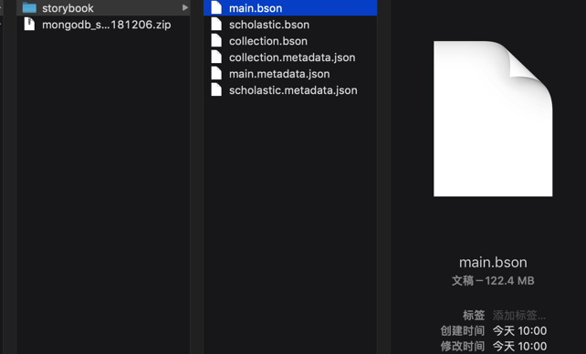
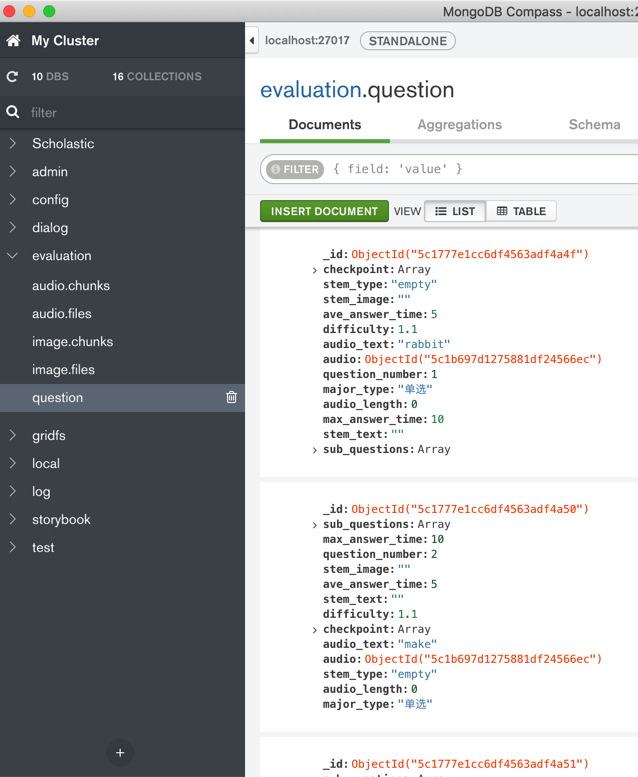

# `mongodump`和`mongorestore`

概述：

* **mongodump**
  * 导出整个数据库(`db`)
    ```bash
    mongodump -d databaseName -o outputFolder
    ```
    * 输出目录如果是：当前目录`.`
      ```bash
      mongodump -d databaseName -o .
      ```
  * 导出数据库(`db`)中某个集合(`Collection`)=`子表`
    ```bash
    mongodump -d databaseName -c CollectionName -o outputFolder
    ```
    * 输出目录如果是：当前目录`.`
      ```bash
      mongodump -d databaseName -c CollectionName -o .
      ```
  * 其他说明
    * 导出的单个collection文件名一般是`collectionName.bson`和`collectionName.metadata.json`
* **mongorestore**
  * 恢复（导入）某个目录下的某个数据库(`db`)中的所有的集合(`collection`)
    ```bash
    mongorestore -d databaseName ./localSubFoler
    ```
    * 说明：当前目录`localSubFoler`中有一个或多个`*.bson`(以及对应的`*.metadata.json`)
    * 举例
      ```bash
      mongorestore -d storybook ./storybook
      ```
  * 恢复（导入）某个数据库(`db`)中的单个集合(`collection`)
    ```bash
    mongorestore -d databaseName -c CollectionName subFolder/someCollection.bson
    ```
    * 注：mongorestore从文件导入数据的话，**不支持JSON**文件，**只支持BSON**文件
      * 且是用mongodump导出的BSON文件
    * 举例
      ```bash
      mongorestore -d storybook -c lexile ./storybook/lexile.bson
      ```
* 通用参数
  * 额外指定`host`和`port`
    * 举例
      ```bash
      mongorestore -h localhost --port 32018 -d storybook ./storybook
      ```
  * 额外指定（对应数据库和表的）`用户名`和`密码`
    * 举例
      ```bash
      mongorestore -h localhost --port 32018 -u storybook -p yourPassword -d storybook ./storybook
      ```

详解：

## mongodump备份

* 导出 本地MongoDB 的某表到当前文件夹
  * `mongodump -d storybook -o .`
* 导出 本地MongoDB 某表中某集合到当前文件夹，且指定host和port
  * `mongodump -h 127.0.0.1 --port 27017 -d Scholastic -c Storybook -o .`
* 导出 远程阿里云的MongoDB 某表中某集合到当前文件夹，且指定host和port，以及指定用户名和密码
  * `mongodump --host dds-xxx.mongodb.rds.aliyuncs.com --port xxx --authenticationDatabase admin -u root -p xxx -d exercise -o .`

参数解释：

* `-d`=`--database`：数据库 Scholastic
* `-c`=`--collection`：集合=表，Storybook
* `--type`：默认为`json`
    * 所以此处可以不传此参数，用默认值
* `-o`==`--out`：`.` 表示 **当前文件夹**

shell输出：

```bash
Scholastic
    Storybook.bson # 数据文件, 60M
    Storybook.metadata.json # 元数据, 130B
```

举例：

```bash
[root@xxx-general-01 exercise]# mongodump --host dds-xxx.mongodb.rds.aliyuncs.com --port xxx --authenticationDatabase admin -u root -p xxx -d exercise -o .
2019-03-07T11:30:24.036+0800    writing exercise.storybook to 
2019-03-07T11:30:24.037+0800    writing exercise.unit to 
2019-03-07T11:30:24.037+0800    writing exercise.dialog to 
2019-03-07T11:30:24.037+0800    writing exercise.audio.files to 
2019-03-07T11:30:24.038+0800    done dumping exercise.storybook (2 documents)
2019-03-07T11:30:24.038+0800    writing exercise.audio.chunks to 
2019-03-07T11:30:24.038+0800    done dumping exercise.unit (1 document)
2019-03-07T11:30:24.039+0800    done dumping exercise.audio.chunks (1 document)
2019-03-07T11:30:24.047+0800    done dumping exercise.audio.files (1 document)
2019-03-07T11:30:24.048+0800    done dumping exercise.dialog (1 document)
[root@xxx-general-01 exercise]# ll
total 4
drwxr-xr-x 2 root root 4096 Mar  7 11:30 exercise
[root@xxx-general-01 exercise]# ll exercise/
total 60
-rw-r--r-- 1 root root 20737 Mar  7 11:30 audio.chunks.bson
-rw-r--r-- 1 root root   195 Mar  7 11:30 audio.chunks.metadata.json
-rw-r--r-- 1 root root   249 Mar  7 11:30 audio.files.bson
-rw-r--r-- 1 root root   197 Mar  7 11:30 audio.files.metadata.json
-rw-r--r-- 1 root root   554 Mar  7 11:30 dialog.bson
-rw-r--r-- 1 root root    87 Mar  7 11:30 dialog.metadata.json
-rw-r--r-- 1 root root   834 Mar  7 11:30 storybook.bson
-rw-r--r-- 1 root root    90 Mar  7 11:30 storybook.metadata.json
-rw-r--r-- 1 root root   309 Mar  7 11:30 unit.bson
-rw-r--r-- 1 root root    85 Mar  7 11:30 unit.metadata.json
```


另附上，之前某次导出的数据的文件如下：



### mongodump语法help帮助

```bash
➜  output git:(master) ✗ mongodump --help
Usage:
  mongodump <options>

Export the content of a running server into .bson files.

Specify a database with -d and a collection with -c to only dump that database or collection.

See http://docs.mongodb.org/manual/reference/program/mongodump/ for more information.

general options:
      --help                                                print usage
      --version                                             print the tool version and exit

verbosity options:
  -v, --verbose=<level>                                     more detailed log output (include multiple times for more verbosity, e.g. -vvvvv, or specify a
                                                            numeric value, e.g. --verbose=N)
      --quiet                                               hide all log output

connection options:
  -h, --host=<hostname>                                     mongodb host to connect to (setname/host1,host2 for replica sets)
      --port=<port>                                         server port (can also use --host hostname:port)

ssl options:
      --ssl                                                 connect to a mongod or mongos that has ssl enabled
      --sslCAFile=<filename>                                the .pem file containing the root certificate chain from the certificate authority
      --sslPEMKeyFile=<filename>                            the .pem file containing the certificate and key
      --sslPEMKeyPassword=<password>                        the password to decrypt the sslPEMKeyFile, if necessary
      --sslCRLFile=<filename>                               the .pem file containing the certificate revocation list
      --sslAllowInvalidCertificates                         bypass the validation for server certificates
      --sslAllowInvalidHostnames                            bypass the validation for server name
      --sslFIPSMode                                         use FIPS mode of the installed openssl library

authentication options:
  -u, --username=<username>                                 username for authentication
  -p, --password=<password>                                 password for authentication
      --authenticationDatabase=<database-name>              database that holds the user's credentials
      --authenticationMechanism=<mechanism>                 authentication mechanism to use

namespace options:
  -d, --db=<database-name>                                  database to use
  -c, --collection=<collection-name>                        collection to use

uri options:
      --uri=mongodb-uri                                     mongodb uri connection string

query options:
  -q, --query=                                              query filter, as a JSON string, e.g., '{x:{$gt:1}}'
      --queryFile=                                          path to a file containing a query filter (JSON)
      --readPreference=<string>|<json>                      specify either a preference name or a preference json object
      --forceTableScan                                      force a table scan

output options:
  -o, --out=<directory-path>                                output directory, or '-' for stdout (defaults to 'dump')
      --gzip                                                compress archive our collection output with Gzip
      --repair                                              try to recover documents from damaged data files (not supported by all storage engines)
      --oplog                                               use oplog for taking a point-in-time snapshot
      --archive=<file-path>                                 dump as an archive to the specified path. If flag is specified without a value, archive is written
                                                            to stdout
      --dumpDbUsersAndRoles                                 dump user and role definitions for the specified database
      --excludeCollection=<collection-name>                 collection to exclude from the dump (may be specified multiple times to exclude additional
                                                            collections)
      --excludeCollectionsWithPrefix=<collection-prefix>    exclude all collections from the dump that have the given prefix (may be specified multiple times
                                                            to exclude additional prefixes)
  -j, --numParallelCollections=                             number of collections to dump in parallel (4 by default) (default: 4)
      --viewsAsCollections                                  dump views as normal collections with their produced data, omitting standard collections
```

## mongorestore恢复

举例：

* 从某个目录，导入整个database：

```bash
➜  from_server ll
total 48
drwxr-xr-x  12 crifan  staff   384B  3  7 11:30 exercise
-rw-r--r--@  1 crifan  staff    20K  3  7 11:32 exercise_290307.zip
➜  from_server ll exercise
total 120
-rw-r--r--  1 crifan  staff    20K  3  7 11:30 audio.chunks.bson
-rw-r--r--  1 crifan  staff   195B  3  7 11:30 audio.chunks.metadata.json
-rw-r--r--  1 crifan  staff   249B  3  7 11:30 audio.files.bson
-rw-r--r--  1 crifan  staff   197B  3  7 11:30 audio.files.metadata.json
-rw-r--r--  1 crifan  staff   554B  3  7 11:30 dialog.bson
-rw-r--r--  1 crifan  staff    87B  3  7 11:30 dialog.metadata.json
-rw-r--r--  1 crifan  staff   834B  3  7 11:30 storybook.bson
-rw-r--r--  1 crifan  staff    90B  3  7 11:30 storybook.metadata.json
-rw-r--r--  1 crifan  staff   309B  3  7 11:30 unit.bson
-rw-r--r--  1 crifan  staff    85B  3  7 11:30 unit.metadata.json
➜  from_server mongorestore -d exercise ./exercise
2019-03-07T11:51:15.303+0800    the --db and --collection args should only be used when restoring from a BSON file. Other uses are deprecated and will not exist in the future; use --nsInclude instead
2019-03-07T11:51:15.305+0800    building a list of collections to restore from exercise dir
2019-03-07T11:51:15.308+0800    reading metadata for exercise.audio.chunks from exercise/audio.chunks.metadata.json
2019-03-07T11:51:15.309+0800    reading metadata for exercise.storybook from exercise/storybook.metadata.json
2019-03-07T11:51:15.309+0800    reading metadata for exercise.dialog from exercise/dialog.metadata.json
2019-03-07T11:51:15.310+0800    reading metadata for exercise.unit from exercise/unit.metadata.json
2019-03-07T11:51:15.585+0800    restoring exercise.unit from exercise/unit.bson
2019-03-07T11:51:15.678+0800    restoring exercise.storybook from exercise/storybook.bson
2019-03-07T11:51:15.760+0800    restoring exercise.dialog from exercise/dialog.bson
2019-03-07T11:51:15.846+0800    restoring exercise.audio.chunks from exercise/audio.chunks.bson
2019-03-07T11:51:15.851+0800    no indexes to restore
2019-03-07T11:51:15.851+0800    finished restoring exercise.dialog (1 document)
2019-03-07T11:51:15.851+0800    no indexes to restore
2019-03-07T11:51:15.851+0800    finished restoring exercise.unit (1 document)
2019-03-07T11:51:15.858+0800    restoring indexes for collection exercise.audio.chunks from metadata
2019-03-07T11:51:15.860+0800    no indexes to restore
2019-03-07T11:51:15.860+0800    finished restoring exercise.storybook (2 documents)
2019-03-07T11:51:15.864+0800    reading metadata for exercise.audio.files from exercise/audio.files.metadata.json
2019-03-07T11:51:15.930+0800    finished restoring exercise.audio.chunks (1 document)
2019-03-07T11:51:16.029+0800    restoring exercise.audio.files from exercise/audio.files.bson
2019-03-07T11:51:16.031+0800    restoring indexes for collection exercise.audio.files from metadata
2019-03-07T11:51:16.077+0800    finished restoring exercise.audio.files (1 document)
2019-03-07T11:51:16.077+0800    done
➜  from_server
```

* 导入单个collection：

```bash
➜  mongodb_migration git:(master) pwd
/Users/crifan/xxx/pyspider_migration/mongodb_migration
➜  mongodb_migration git:(master) ll storybook
total 416536
-rw-r--r--  1 crifan  staff    34M 11 26 11:58 lexile.bson
-rw-r--r--  1 crifan  staff   130B 11 26 11:58 lexile.metadata.json
-rw-r--r--  1 crifan  staff   106M 11 26 11:58 main.bson
-rw-r--r--  1 crifan  staff   128B 11 26 11:58 main.metadata.json
-rw-r--r--  1 crifan  staff    62M 11 26 11:58 scholastic.bson
-rw-r--r--  1 crifan  staff   134B 11 26 11:58 scholastic.metadata.json
➜  mongodb_migration git:(master) mongorestore -d storybook -c lexile ./storybook/lexile.bson
2019-01-03T14:58:44.324+0800    checking for collection data in storybook/lexile.bson
2019-01-03T14:58:44.328+0800    reading metadata for storybook.lexile from storybook/lexile.metadata.json
2019-01-03T14:58:44.480+0800    restoring storybook.lexile from storybook/lexile.bson
2019-01-03T14:58:45.166+0800    no indexes to restore
2019-01-03T14:58:45.166+0800    finished restoring storybook.lexile (29911 documents)
2019-01-03T14:58:45.166+0800    done
```

* 已有一个之前用mongodump备份出来的文件夹：evaluation，其中保存了整个evaluation的database的数据，将其恢复到此处本地的mongodb数据库

```bash
➜  mongodb mongorestore -d evaluation ./evaluation
2018-12-21T13:36:00.173+0800    the --db and --collection args should only be used when restoring from a BSON file. Other uses are deprecated and will not exist in the future; use --nsInclude instead
2018-12-21T13:36:00.175+0800    building a list of collections to restore from evaluation dir
2018-12-21T13:36:00.176+0800    reading metadata for evaluation.image.chunks from evaluation/image.chunks.metadata.json
2018-12-21T13:36:00.176+0800    reading metadata for evaluation.question from evaluation/question.metadata.json
2018-12-21T13:36:00.176+0800    reading metadata for evaluation.audio.chunks from evaluation/audio.chunks.metadata.json
2018-12-21T13:36:00.274+0800    restoring evaluation.image.chunks from evaluation/image.chunks.bson
2018-12-21T13:36:00.277+0800    reading metadata for evaluation.image.files from evaluation/image.files.metadata.json
2018-12-21T13:36:00.393+0800    restoring evaluation.audio.chunks from evaluation/audio.chunks.bson
2018-12-21T13:36:00.475+0800    restoring evaluation.question from evaluation/question.bson
2018-12-21T13:36:00.571+0800    restoring evaluation.image.files from evaluation/image.files.bson
2018-12-21T13:36:00.579+0800    restoring indexes for collection evaluation.audio.chunks from metadata
2018-12-21T13:36:00.653+0800    finished restoring evaluation.audio.chunks (1 document)
2018-12-21T13:36:00.654+0800    reading metadata for evaluation.audio.files from evaluation/audio.files.metadata.json
2018-12-21T13:36:00.739+0800    restoring evaluation.audio.files from evaluation/audio.files.bson
2018-12-21T13:36:00.747+0800    no indexes to restore
2018-12-21T13:36:00.747+0800    finished restoring evaluation.question (880 documents)
2018-12-21T13:36:00.747+0800    restoring indexes for collection evaluation.audio.files from metadata
2018-12-21T13:36:00.823+0800    finished restoring evaluation.audio.files (1 document)
2018-12-21T13:36:00.825+0800    restoring indexes for collection evaluation.image.files from metadata
2018-12-21T13:36:00.932+0800    finished restoring evaluation.image.files (663 documents)
2018-12-21T13:36:03.167+0800    [##############..........]  evaluation.image.chunks  222MB/357MB  (62.1%)
2018-12-21T13:36:04.849+0800    [########################]  evaluation.image.chunks  357MB/357MB  (100.0%)
2018-12-21T13:36:04.849+0800    restoring indexes for collection evaluation.image.chunks from metadata
2018-12-21T13:36:04.974+0800    finished restoring evaluation.image.chunks (1829 documents)
2018-12-21T13:36:04.974+0800    done
```

导入后的MongoDB Compass中数据效果：



* 带指定用户名和密码的

```bash
[root@xxx-general-01 for_backup_mongodb]# mongorestore -h localhost --port 32018 -u storybook -p pwd -d storybook ./storybook
2018-10-30T13:59:21.040+0800    building a list of collections to restore from storybook dir
2018-10-30T13:59:21.041+0800    reading metadata for storybook.scholastic from storybook/scholastic.metadata.json
2018-10-30T13:59:21.041+0800    reading metadata for storybook.main from storybook/main.metadata.json
2018-10-30T13:59:21.061+0800    restoring storybook.main from storybook/main.bson
2018-10-30T13:59:21.075+0800    restoring storybook.scholastic from storybook/scholastic.bson
2018-10-30T13:59:22.567+0800    restoring indexes for collection storybook.scholastic from metadata
2018-10-30T13:59:22.567+0800    finished restoring storybook.scholastic (51785 documents)
2018-10-30T13:59:22.629+0800    restoring indexes for collection storybook.main from metadata
2018-10-30T13:59:22.629+0800    finished restoring storybook.main (51785 documents)
2018-10-30T13:59:22.629+0800    done
```
