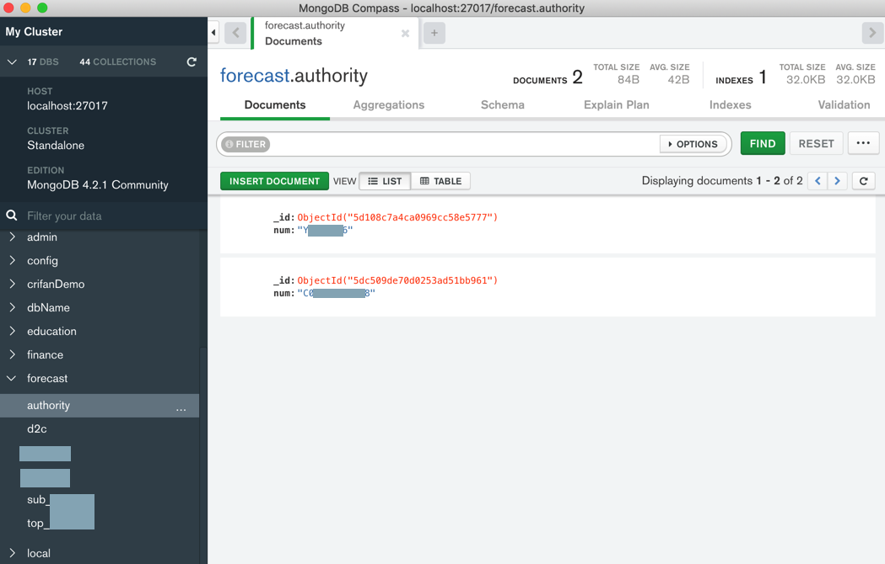
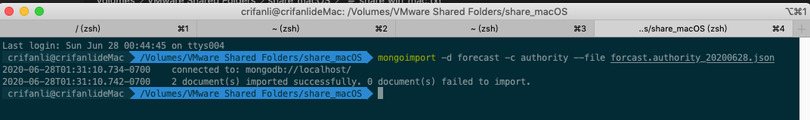
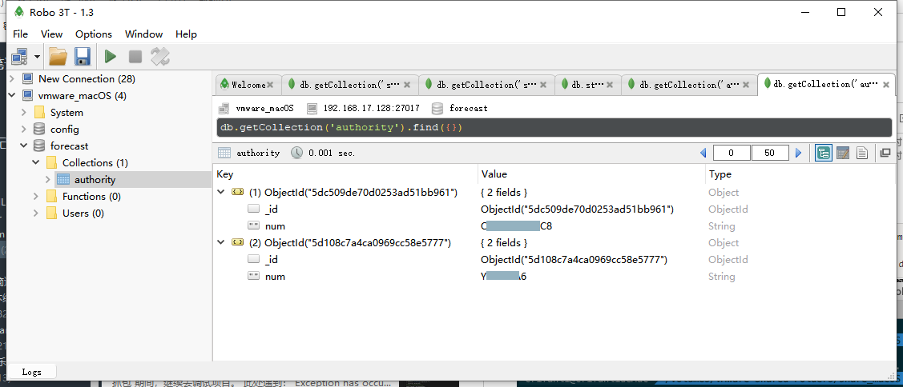

# `mongoexport`和`mongoimport`

基本语法：

`mongoimport -d database_name -c collection_name --file exported_mongodb_collection_file.json`

## 举例

### 导出数据库`evaluation`的集合`question`

`mongoimport -d evaluation -c question --file questions_181219_2.json`

### 导出和恢复authority

背景：

Mac中MongoDB中有如下数据：



然后去导出：

单个database数据库`forecast`中某个特定的collection集合`authority`的数据

```bash
mongoexport -d forecast -c authority -o forcast.authority_20200628.json
```

具体log：

```bash
limao@xxx  ~/Downloads/mongo_data  mongoexport -d forecast -c authority -o forcast.authority_20200628.json
2020-06-28T16:26:15.600+0800    connected to: mongodb://localhost/
2020-06-28T16:26:15.614+0800    exported 2 records
limao@xxx  ~/Downloads/mongo_data  ll
total 8
-rw-r--r--  1 limao  CORP\Domain Users   126B  6 28 16:26 forcast.authority_20200628.json
```

然后把此`json`文件弄到`Win`中`VMWare`中的`macOS`之后，再去恢复：

```bash
mongoimport -d forecast -c authority --file forcast.authority_20200628.json
```

具体log：

```bash
crifanli@crifanlideMac  /Volumes/VMware Shared Folders/share_macOS  mongoimport -d forecast -c authority --file forcast.authority_20200628.json
2020-06-28T01:31:10.734-0700    connected to: mongodb://localhost/
2020-06-28T01:31:10.742-0700    2 document(s) imported successfully. 0 document(s) failed to import.
```



Win中（能连接到macOS中MongoDB的）mongo的GUI客户端`Robot 3T`中，刷新后即可看到导入的数据：


