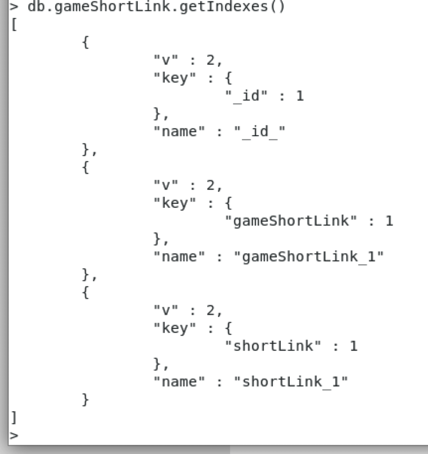
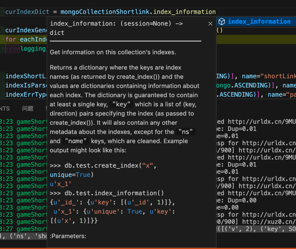
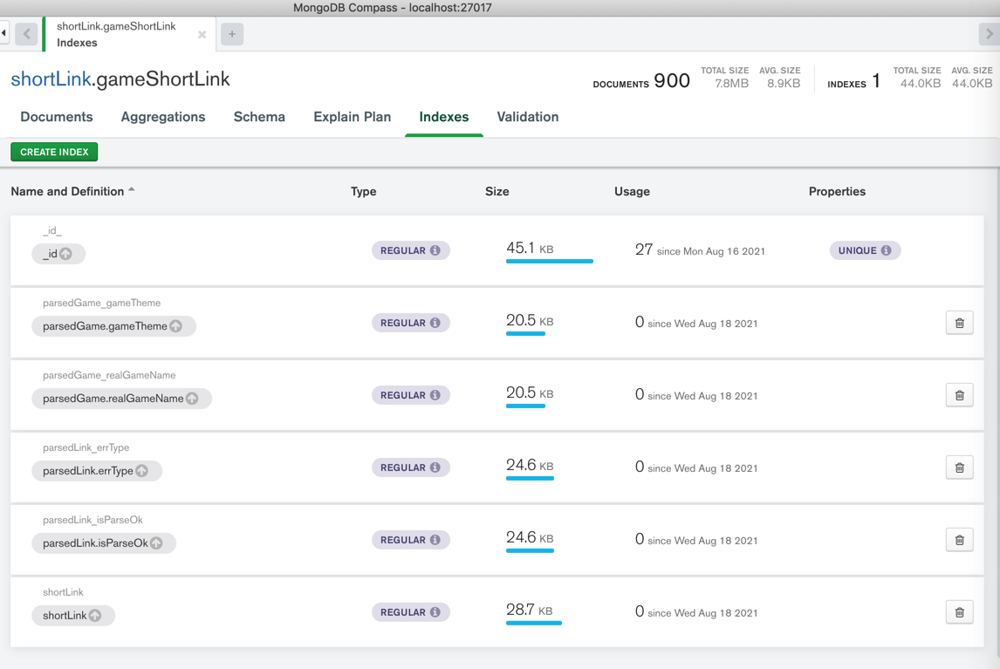

# 查看索引

## mongo shell

```bash
db.gameShortLink.getIndexes()
```

举例：


## pymongo代码

### index_information

代码：

```python
curIndexDict = mongoCollectionShortlink.index_information()
```

写代码期间，VSCode的代码函数提示：效果很好



输出：

```bash
curIndexDict={'_id_': {'v': 2, 'key': [('_id', 1)], 'ns': 'shortLink.gameShortLink'}, 'shortLink': {'v': 2, 'key': [('shortLink', 1)], 'ns': 'shortLink.gameShortLink'}, 'parsedLink_isParseOk': {'v': 2, 'key': [('parsedLink.isParseOk', 1)], 'ns': 'shortLink.gameShortLink'}, 'parsedLink_errType': {'v': 2, 'key': [('parsedLink.errType', 1)], 'ns': 'shortLink.gameShortLink'}, 'parsedGame_realGameName': {'v': 2, 'key': [('parsedGame.realGameName', 1)], 'ns': 'shortLink.gameShortLink'}, 'parsedGame_gameTheme': {'v': 2, 'key': [('parsedGame.gameTheme', 1)], 'ns': 'shortLink.gameShortLink'}}
```

格式化后：

```json
{
    "_id_": {
        "v": 2,
        "key": [
            ("_id", 1)
        ],
        "ns": "shortLink.gameShortLink"
    },
    "shortLink": {
        "v": 2, "key": [("shortLink", 1)], "ns": "shortLink.gameShortLink"
    },
    "parsedLink_isParseOk": {
        "v": 2, "key": [("parsedLink.isParseOk", 1)], "ns": "shortLink.gameShortLink"
    },
    "parsedLink_errType": {
        "v": 2, "key": [("parsedLink.errType", 1)], "ns": "shortLink.gameShortLink"
    },
    "parsedGame_realGameName": {
        "v": 2, "key": [("parsedGame.realGameName", 1)], "ns": "shortLink.gameShortLink"
    },
    "parsedGame_gameTheme": {
        "v": 2, "key": [("parsedGame.gameTheme", 1)], "ns": "shortLink.gameShortLink"
    }
}
```

-》其中最重要的是：

name中的key的list中的tuple中的键值

比如：

* shortLink
* parsedLink.isParseOk
* parsedLink.errType
* parsedGame.realGameName
* parsedGame.gameTheme

是索引对应的字段。

官网文档：

[collection – Collection level operations — PyMongo 3.12.0 documentation](https://pymongo.readthedocs.io/en/stable/api/pymongo/collection.html#pymongo.collection.Collection.index_information)

### list_indexes

此处现有索引：

MongoDB Compass中看到的效果是：



代码：

```python
        curIndexGenerator = mongoCollectionShortlink.list_indexes()
        for eachIndex in curIndexGenerator:
            logging.info("eachIndex=%s", eachIndex)
```

输出：

```bash
20210818 02:20:14 gameShortLinkParseGameType.py:406  INFO    eachIndex=SON([('v', 2), ('key', SON([('_id', 1)])), ('name', '_id_'), ('ns', 'shortLink.gameShortLink')])
20210818 02:20:16 gameShortLinkParseGameType.py:406  INFO    eachIndex=SON([('v', 2), ('key', SON([('shortLink', 1)])), ('name', 'shortLink'), ('ns', 'shortLink.gameShortLink')])
20210818 02:20:16 gameShortLinkParseGameType.py:406  INFO    eachIndex=SON([('v', 2), ('key', SON([('parsedLink.isParseOk', 1)])), ('name', 'parsedLink_isParseOk'), ('ns', 'shortLink.gameShortLink')])
20210818 02:20:18 gameShortLinkParseGameType.py:406  INFO    eachIndex=SON([('v', 2), ('key', SON([('parsedLink.errType', 1)])), ('name', 'parsedLink_errType'), ('ns', 'shortLink.gameShortLink')])
20210818 02:20:19 gameShortLinkParseGameType.py:406  INFO    eachIndex=SON([('v', 2), ('key', SON([('parsedGame.realGameName', 1)])), ('name', 'parsedGame_realGameName'), ('ns', 'shortLink.gameShortLink')])
20210818 02:20:19 gameShortLinkParseGameType.py:406  INFO    eachIndex=SON([('v', 2), ('key', SON([('parsedGame.gameTheme', 1)])), ('name', 'parsedGame_gameTheme'), ('ns', 'shortLink.gameShortLink')])
```

