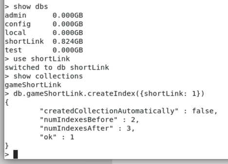
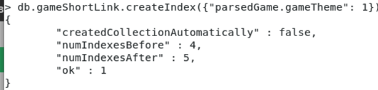
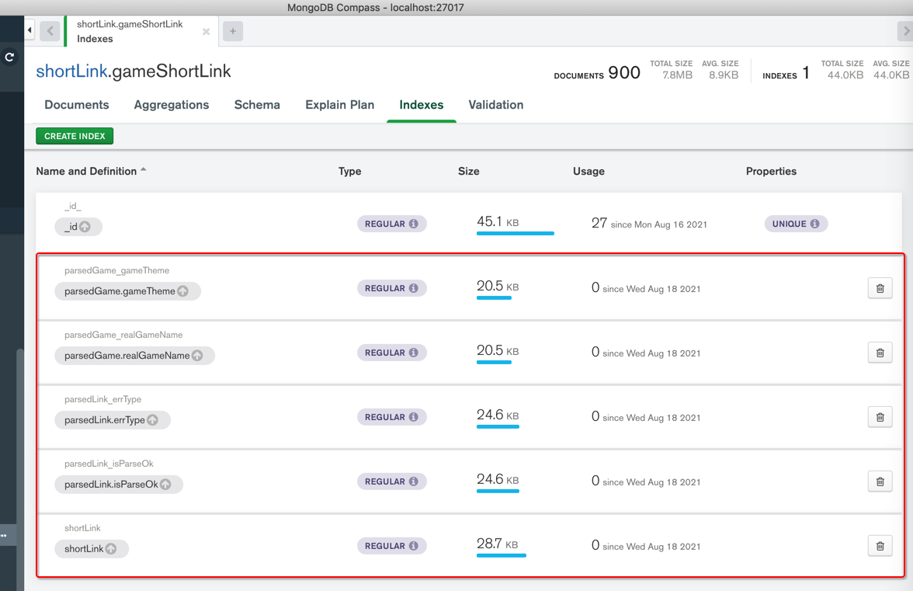
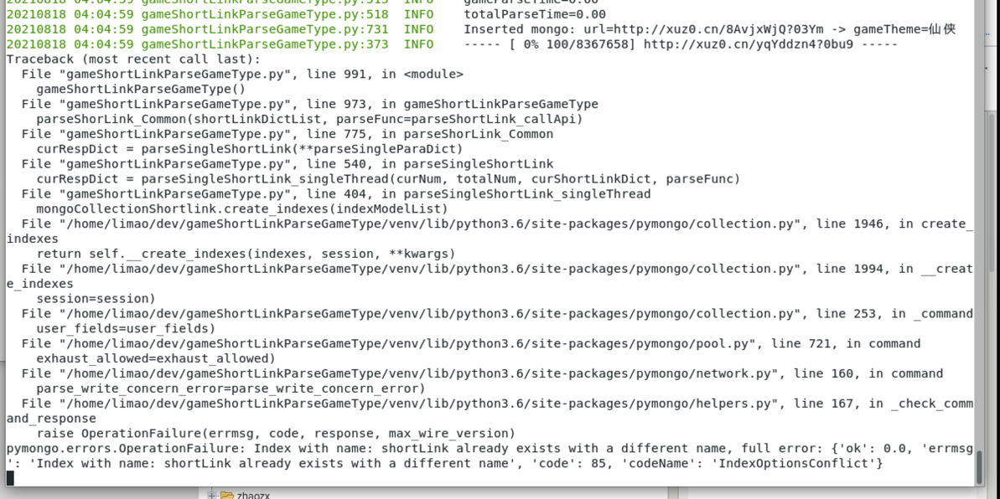
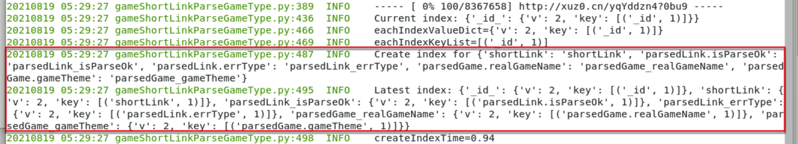
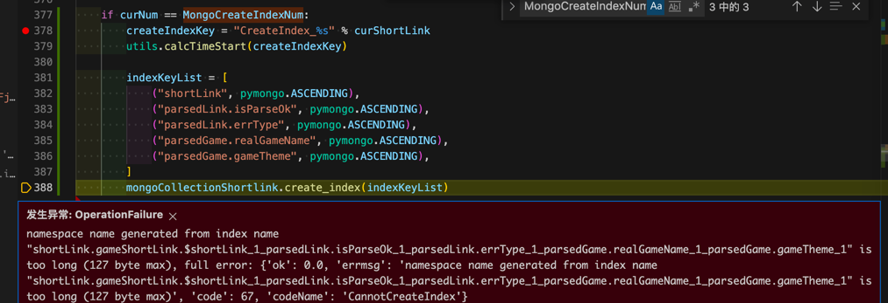

# 创建索引

数据举例：

```json
{
  "_id": { "$oid": "6114ce86447cece703d3e943" },
  "parsedLink": {
    "isParseOk": true,
    。。。
  },
  "parsedGame": {
    。。。
    },
    "realGameName": "绝世仙王",
    "gameTheme": "仙侠",
    "gamePlay": "动作"
  },
  "shortLink": "http://xuz0.cn/x13Xn7Sq?00KC",
  "updateTime": "2021-08-12 15:32:12",
  "input": {
    。。。
    "generateDate": "20210802"
  }
}
```

## Mongo shell

### 建索引

```bash
db.gameShortLink.createIndex({shortLink: 1})
```

举例：



### 给子字段建索引

举例：

```bash
db.gameShortLink.createIndex( { "parsedGame.realGameName": 1 } )
db.gameShortLink.createIndex( { "parsedGame.gameTheme": 1 } )
```



## pymongo代码

相关官网文档：

* pymongo
  * create_index
    * [collection – Collection level operations — PyMongo 3.12.0 documentation](https://pymongo.readthedocs.io/en/stable/api/pymongo/collection.html#pymongo.collection.Collection.create_index)

### 一次性创建多个索引

如果确保，要创建的 索引没重复，则可以直接用

```python
import pymongo
from pymongo import IndexModel
# from pymongo import ASCENDING, DESCENDING

indexShortLink = IndexModel([("shortLink", pymongo.ASCENDING)], name="shortLink")
indexIsParseOk = IndexModel([("parsedLink.isParseOk", pymongo.ASCENDING)], name="parsedLink_isParseOk")
indexErrType = IndexModel([("parsedLink.errType", pymongo.ASCENDING)], name="parsedLink_errType")
indexRealGameName = IndexModel([("parsedGame.realGameName", pymongo.ASCENDING)], name="parsedGame_realGameName")
indexGameTheme = IndexModel([("parsedGame.gameTheme", pymongo.ASCENDING)], name="parsedGame_gameTheme")
indexModelList = [
    indexShortLink,
    indexIsParseOk,
    indexErrType,
    indexRealGameName,
    indexGameTheme,
]
mongoCollectionShortlink.create_indexes(indexModelList)
```

Compass（刷新后）中能看到添加的索引信息：



#### 常见错误

##### errmsg code 85 codeName IndexOperationConflict

如果有重复索引，则会报错：



```bash
raise OperationFailure
pymongo.errors.OperationFailure
Index with name shortLink already exists with a different name, full error ok 0.0
errmsg code 85 codeName IndexOperationConflict
```

解决办法：先过滤掉已存在的，只创建不存在的

完整代码：

```python
        toCreateIndexKeyNameDict = {
            "shortLink": "shortLink",
            "parsedLink.isParseOk": "parsedLink_isParseOk",
            "parsedLink.errType": "parsedLink_errType",
            "parsedGame.realGameName": "parsedGame_realGameName",
            "parsedGame.gameTheme": "parsedGame_gameTheme",
        }


        # Note: check existed to avoid:
        #   Index with name already exists with a different name full error
        # and only create_index for not existed
        curIndexDict = mongoCollectionShortlink.index_information()
        logging.info("Current index: %s", curIndexDict)
        # Current index: {'_id_': {'v': 2, 'key': [('_id', 1)], 'ns': 'shortLink.gameShortLink'}, 'shortLink': {'v': 2, 'key': [('shortLink', 1)], 'ns': 'shortLink.gameShortLink'}, 'parsedLink_isParseOk': {'v': 2, 'key': [('parsedLink.isParseOk', 1)], 'ns': 'shortLink.gameShortLink'}, 'parsedLink_errType': {'v': 2, 'key': [('parsedLink.errType', 1)], 'ns': 'shortLink.gameShortLink'}, 'parsedGame_realGameName': {'v': 2, 'key': [('parsedGame.realGameName', 1)], 'ns': 'shortLink.gameShortLink'}, 'parsedGame_gameTheme': {'v': 2, 'key': [('parsedGame.gameTheme', 1)], 'ns': 'shortLink.gameShortLink'}}
        """
            {
                "_id_": {
                    "v": 2,
                    "key": [
                        ("_id", 1)
                    ],
                    "ns": "shortLink.gameShortLink"
                },
                "shortLink": {
                    "v": 2, "key": [("shortLink", 1)], "ns": "shortLink.gameShortLink"
                },
                "parsedLink_isParseOk": {
                    "v": 2, "key": [("parsedLink.isParseOk", 1)], "ns": "shortLink.gameShortLink"
                },
                "parsedLink_errType": {
                    "v": 2, "key": [("parsedLink.errType", 1)], "ns": "shortLink.gameShortLink"
                },
                "parsedGame_realGameName": {
                    "v": 2, "key": [("parsedGame.realGameName", 1)], "ns": "shortLink.gameShortLink"
                },
                "parsedGame_gameTheme": {
                    "v": 2, "key": [("parsedGame.gameTheme", 1)], "ns": "shortLink.gameShortLink"
                }
            }
        """
        allIndexKeyList = []
        for _, eachIndexValueDict in curIndexDict.items():
            logging.info("eachIndexValueDict=%s", eachIndexValueDict)
            # eachIndexKey=_id_, eachIndexValueDict={'v': 2, 'key': [('_id', 1)], 'ns': 'shortLink.gameShortLink'}
            eachIndexKeyList = eachIndexValueDict["key"]
            logging.info("eachIndexKeyList=%s", eachIndexKeyList)
            for eachIndexKeyName, _direction in eachIndexKeyList:
                allIndexKeyList.append(eachIndexKeyName)


        newIndexKeyNameDict = {}
        for eachToCreateIndexKey, eachToCreateIndexName in toCreateIndexKeyNameDict.items():
            if eachToCreateIndexKey in allIndexKeyList:
                logging.info("Not create_index for existed index %s:%s ", eachToCreateIndexKey, eachToCreateIndexName)
                isNeedReIndex = True
            else:
                newIndexKeyNameDict[eachToCreateIndexKey] = eachToCreateIndexName


        newIndexModelList = []
        for eachNewIndexKey, eachNewIndexName in newIndexKeyNameDict.items():
            eachNewIndexModel = IndexModel([(eachNewIndexKey, pymongo.ASCENDING)], name=eachNewIndexName)
            newIndexModelList.append(eachNewIndexModel)


        if newIndexModelList:
            logging.info("Create index for %s", newIndexKeyNameDict)
            mongoCollectionShortlink.create_indexes(newIndexModelList)


        # curIndexGenerator = mongoCollectionShortlink.list_indexes()
        # for eachIndex in curIndexGenerator:
        #     logging.info("eachIndex=%s", eachIndex)


        latestIndexDict = mongoCollectionShortlink.index_information()
        logging.info("Latest index: %s", latestIndexDict)
```

输出：

```bash
20210819 01:14:02 gameShortLinkParseGameType.py:420  INFO    Current index: {'_id_': {'v': 2, 'key': [('_id', 1)], 'ns': 'shortLink.gameShortLink'}, 'shortLink': {'v': 2, 'key': [('shortLink', 1)], 'ns': 'shortLink.gameShortLink'}, 'parsedLink_isParseOk': {'v': 2, 'key': [('parsedLink.isParseOk', 1)], 'ns': 'shortLink.gameShortLink'}, 'parsedLink_errType': {'v': 2, 'key': [('parsedLink.errType', 1)], 'ns': 'shortLink.gameShortLink'}}
20210819 01:14:02 gameShortLinkParseGameType.py:450  INFO    eachIndexValueDict={'v': 2, 'key': [('_id', 1)], 'ns': 'shortLink.gameShortLink'}
20210819 01:14:02 gameShortLinkParseGameType.py:453  INFO    eachIndexKeyList=[('_id', 1)]
20210819 01:14:02 gameShortLinkParseGameType.py:450  INFO    eachIndexValueDict={'v': 2, 'key': [('shortLink', 1)], 'ns': 'shortLink.gameShortLink'}
20210819 01:14:02 gameShortLinkParseGameType.py:453  INFO    eachIndexKeyList=[('shortLink', 1)]
20210819 01:14:02 gameShortLinkParseGameType.py:450  INFO    eachIndexValueDict={'v': 2, 'key': [('parsedLink.isParseOk', 1)], 'ns': 'shortLink.gameShortLink'}
20210819 01:14:02 gameShortLinkParseGameType.py:453  INFO    eachIndexKeyList=[('parsedLink.isParseOk', 1)]
20210819 01:14:02 gameShortLinkParseGameType.py:450  INFO    eachIndexValueDict={'v': 2, 'key': [('parsedLink.errType', 1)], 'ns': 'shortLink.gameShortLink'}
20210819 01:14:02 gameShortLinkParseGameType.py:453  INFO    eachIndexKeyList=[('parsedLink.errType', 1)]
20210819 01:14:09 gameShortLinkParseGameType.py:460  INFO    Not create_index for existed index shortLink:shortLink
20210819 01:14:14 gameShortLinkParseGameType.py:460  INFO    Not create_index for existed index parsedLink.isParseOk:parsedLink_isParseOk
20210819 01:14:17 gameShortLinkParseGameType.py:460  INFO    Not create_index for existed index parsedLink.errType:parsedLink_errType
20210819 01:14:41 gameShortLinkParseGameType.py:471  INFO    Create index for {'parsedGame.realGameName': 'parsedGame_realGameName', 'parsedGame.gameTheme': 'parsedGame_gameTheme'}
20210819 01:15:34 gameShortLinkParseGameType.py:479  INFO    Latest index: {'_id_': {'v': 2, 'key': [('_id', 1)], 'ns': 'shortLink.gameShortLink'}, 'shortLink': {'v': 2, 'key': [('shortLink', 1)], 'ns': 'shortLink.gameShortLink'}, 'parsedLink_isParseOk': {'v': 2, 'key': [('parsedLink.isParseOk', 1)], 'ns': 'shortLink.gameShortLink'}, 'parsedLink_errType': {'v': 2, 'key': [('parsedLink.errType', 1)], 'ns': 'shortLink.gameShortLink'}, 'parsedGame_realGameName': {'v': 2, 'key': [('parsedGame.realGameName', 1)], 'ns': 'shortLink.gameShortLink'}, 'parsedGame_gameTheme': {'v': 2, 'key': [('parsedGame.gameTheme', 1)], 'ns': 'shortLink.gameShortLink'}}
```

线上服务器运行效果：



##### name generated from index name is too long 127 byte

此处没有给index加name，则导致默认生成的name太长而报错：

```bash
发生异常: OperationFailure

namespace name generated from index name "shortLink.gameShortLink.$shortLink_1_parsedLink.isParseOk_1_parsedLink.errType_1_parsedGame.realGameName_1_parsedGame.gameTheme_1" is too long (127 byte max), full error: {'ok': 0.0, 'errmsg': 'namespace name generated from index name "shortLink.gameShortLink.$shortLink_1_parsedLink.isParseOk_1_parsedLink.errType_1_parsedGame.realGameName_1_parsedGame.gameTheme_1" is too long (127 byte max)', 'code': 67, 'codeName': 'CannotCreateIndex'}
```



解决办法：改为`create_indexes`

代码：

```python
indexShortLink = IndexModel([("shortLink", pymongo.ASCENDING)], name="shortLink")
indexIsParseOk = IndexModel([("parsedLink.isParseOk", pymongo.ASCENDING)], name="parsedLink_isParseOk")
indexErrType = IndexModel([("parsedLink.errType", pymongo.ASCENDING)], name="parsedLink_errType")
indexRealGameName = IndexModel([("parsedGame.realGameName", pymongo.ASCENDING)], name="parsedGame_realGameName")
indexGameTheme = IndexModel([("parsedGame.gameTheme", pymongo.ASCENDING)], name="parsedGame_gameTheme")
indexModelList = [
    indexShortLink,
    indexIsParseOk,
    indexErrType,
    indexRealGameName,
    indexGameTheme,
]
mongoCollectionShortlink.create_indexes(indexModelList)
```

### 边运行pymongo代码，边建索引

* 之前：停止Python（的pymongo）代码运行，手动去`mongo shell`中，建索引
* 现在：边运行（pymongo代码），边（通过pymongo代码）建索引

代码：

```python
from pymongo import IndexModel
# from pymongo import ASCENDING, DESCENDING

if isProduction:
。。。
    MongoCreateIndexNum = 100 # first time to create index of mongo
    MongoReindexNumList = [ 500, 1000, 10000, 10*10000, 50*10000 ] # when some num, reindex
else:
。。。
    MongoCreateIndexNum = 100 # first time to create index of mongo
    MongoReindexNumList = [ 200, 300, 500 ] # when some num, reindex
。。。

    isNeedReIndex = False

    if curNum == MongoCreateIndexNum:
        createIndexKey = "CreateIndex_%s" % curShortLink
        utils.calcTimeStart(createIndexKey)

        # indexKeyList = [
        #     ("shortLink", pymongo.ASCENDING),
        #     ("parsedLink.isParseOk", pymongo.ASCENDING),
        #     ("parsedLink.errType", pymongo.ASCENDING),
        #     ("parsedGame.realGameName", pymongo.ASCENDING),
        #     ("parsedGame.gameTheme", pymongo.ASCENDING),
        # ]
        # mongoCollectionShortlink.create_index(indexKeyList)

        # indexShortLink = IndexModel([("shortLink", pymongo.ASCENDING)], name="shortLink")
        # indexIsParseOk = IndexModel([("parsedLink.isParseOk", pymongo.ASCENDING)], name="parsedLink_isParseOk")
        # indexErrType = IndexModel([("parsedLink.errType", pymongo.ASCENDING)], name="parsedLink_errType")
        # indexRealGameName = IndexModel([("parsedGame.realGameName", pymongo.ASCENDING)], name="parsedGame_realGameName")
        # indexGameTheme = IndexModel([("parsedGame.gameTheme", pymongo.ASCENDING)], name="parsedGame_gameTheme")
        # indexModelList = [
        #     indexShortLink,
        #     indexIsParseOk,
        #     indexErrType,
        #     indexRealGameName,
        #     indexGameTheme,
        # ]
        # mongoCollectionShortlink.create_indexes(indexModelList)

        toCreateIndexKeyNameDict = {
            "shortLink": "shortLink",
            "parsedLink.isParseOk": "parsedLink_isParseOk",
            "parsedLink.errType": "parsedLink_errType",
            "parsedGame.realGameName": "parsedGame_realGameName",
            "parsedGame.gameTheme": "parsedGame_gameTheme",
        }

        # Note: check existed to avoid:
        #   Index with name already exists with a different name full error
        # and only create_index for not existed
        curIndexDict = mongoCollectionShortlink.index_information()
        logging.info("Current index: %s", curIndexDict)
        # Current index: {'_id_': {'v': 2, 'key': [('_id', 1)], 'ns': 'shortLink.gameShortLink'}, 'shortLink': {'v': 2, 'key': [('shortLink', 1)], 'ns': 'shortLink.gameShortLink'}, 'parsedLink_isParseOk': {'v': 2, 'key': [('parsedLink.isParseOk', 1)], 'ns': 'shortLink.gameShortLink'}, 'parsedLink_errType': {'v': 2, 'key': [('parsedLink.errType', 1)], 'ns': 'shortLink.gameShortLink'}, 'parsedGame_realGameName': {'v': 2, 'key': [('parsedGame.realGameName', 1)], 'ns': 'shortLink.gameShortLink'}, 'parsedGame_gameTheme': {'v': 2, 'key': [('parsedGame.gameTheme', 1)], 'ns': 'shortLink.gameShortLink'}}
        """
            {
                "_id_": {
                    "v": 2,
                    "key": [
                        ("_id", 1)
                    ],
                    "ns": "shortLink.gameShortLink"
                },
                "shortLink": {
                    "v": 2, "key": [("shortLink", 1)], "ns": "shortLink.gameShortLink"
                },
                "parsedLink_isParseOk": {
                    "v": 2, "key": [("parsedLink.isParseOk", 1)], "ns": "shortLink.gameShortLink"
                },
                "parsedLink_errType": {
                    "v": 2, "key": [("parsedLink.errType", 1)], "ns": "shortLink.gameShortLink"
                },
                "parsedGame_realGameName": {
                    "v": 2, "key": [("parsedGame.realGameName", 1)], "ns": "shortLink.gameShortLink"
                },
                "parsedGame_gameTheme": {
                    "v": 2, "key": [("parsedGame.gameTheme", 1)], "ns": "shortLink.gameShortLink"
                }
            }
        """
        allIndexKeyList = []
        for _, eachIndexValueDict in curIndexDict.items():
            logging.info("eachIndexValueDict=%s", eachIndexValueDict)
            # eachIndexKey=_id_, eachIndexValueDict={'v': 2, 'key': [('_id', 1)], 'ns': 'shortLink.gameShortLink'}
            eachIndexKeyList = eachIndexValueDict["key"]
            logging.info("eachIndexKeyList=%s", eachIndexKeyList)
            for eachIndexKeyName, _direction in eachIndexKeyList:
                allIndexKeyList.append(eachIndexKeyName)

        newIndexKeyNameDict = {}
        for eachToCreateIndexKey, eachToCreateIndexName in toCreateIndexKeyNameDict.items():
            if eachToCreateIndexKey in allIndexKeyList:
                logging.info("Not create_index for existed index %s:%s ", eachToCreateIndexKey, eachToCreateIndexName)
                isNeedReIndex = True
            else:
                newIndexKeyNameDict[eachToCreateIndexKey] = eachToCreateIndexName

        newIndexModelList = []
        for eachNewIndexKey, eachNewIndexName in newIndexKeyNameDict.items():
            eachNewIndexModel = IndexModel([(eachNewIndexKey, pymongo.ASCENDING)], name=eachNewIndexName)
            newIndexModelList.append(eachNewIndexModel)

        if newIndexModelList:
            logging.info("Create index for %s", newIndexKeyNameDict)
            mongoCollectionShortlink.create_indexes(newIndexModelList)

        # curIndexGenerator = mongoCollectionShortlink.list_indexes()
        # for eachIndex in curIndexGenerator:
        #     logging.info("eachIndex=%s", eachIndex)

        latestIndexDict = mongoCollectionShortlink.index_information()
        logging.info("Latest index: %s", latestIndexDict)

        createIndexTime = utils.calcTimeEnd(createIndexKey)
        logging.info("createIndexTime=%.2f", createIndexTime)

    if curNum in MongoReindexNumList:
        isNeedReIndex = True

    if isNeedReIndex:
        reindexKey = "Reindex_%s" % curShortLink
        utils.calcTimeStart(reindexKey)

        mongoDb.command({"reIndex": MongoCollectionName_gameShortLink})

        reindexTime = utils.calcTimeEnd(reindexKey)
        logging.info("reindexTime=%.2f", reindexTime)
```

实现了：

支持本地测试和在线运行

* 建索引
  * 第一次，新建索引
    * 第一次的时机：`number=100`
      * `MongoCreateIndexNum = 100 # first time to create index of mongo`
    * 且判断是否已存在对应索引
      * 已存在：跳过不新建
      * 不存在：新建索引
    * 如果有已存在的，则重新`reIndex`
  * 之后每隔一段，重建索引：`reIndex`
    * 具体间隔是：
      * `MongoReindexNumList = [ 500, 1000, 10000, 10*10000, 50*10000 ] # when some num, reindex`

## 常见问题

### 创建索引，是否后台运行？

创建索引，默认`前台`=`Forground`运行

如果希望后台运行，可以加参数：

```python
my_collection.create_index([("mike", pymongo.DESCENDING)], background=True)
```

关于选`后台`还是`前台`：

* 数据量很大：保险起见，还是前台运行
* 数据量不是很大：可以考虑后台运行

官网文档：

[Index Builds on Populated Collections — MongoDB Manual](https://docs.mongodb.com/manual/core/index-creation/#std-label-index-build-process)
