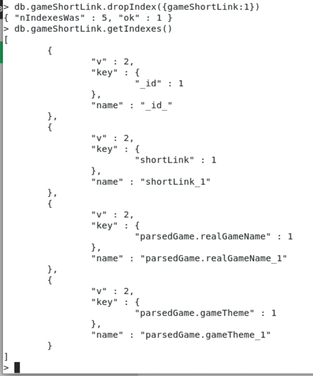
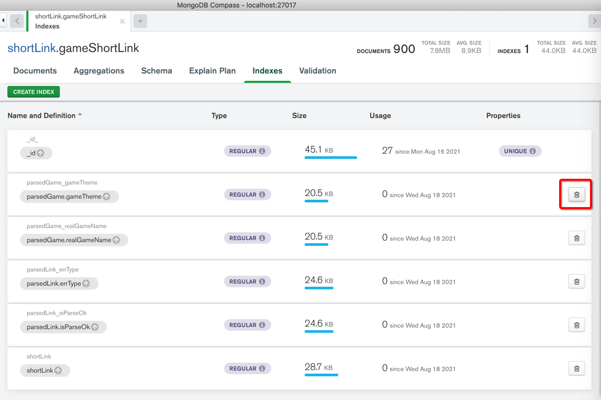
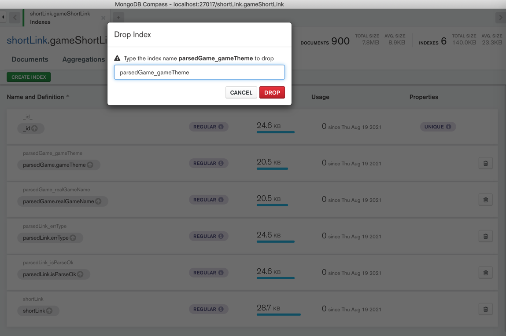
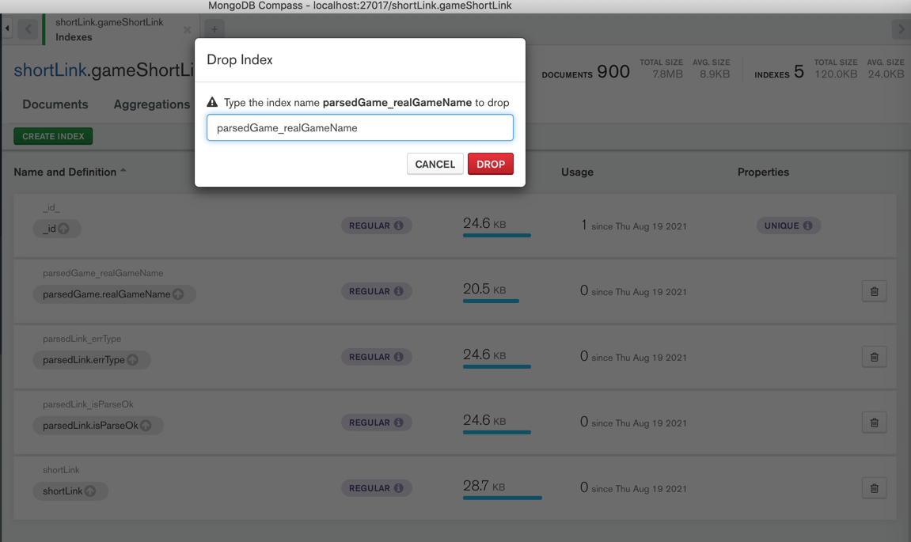
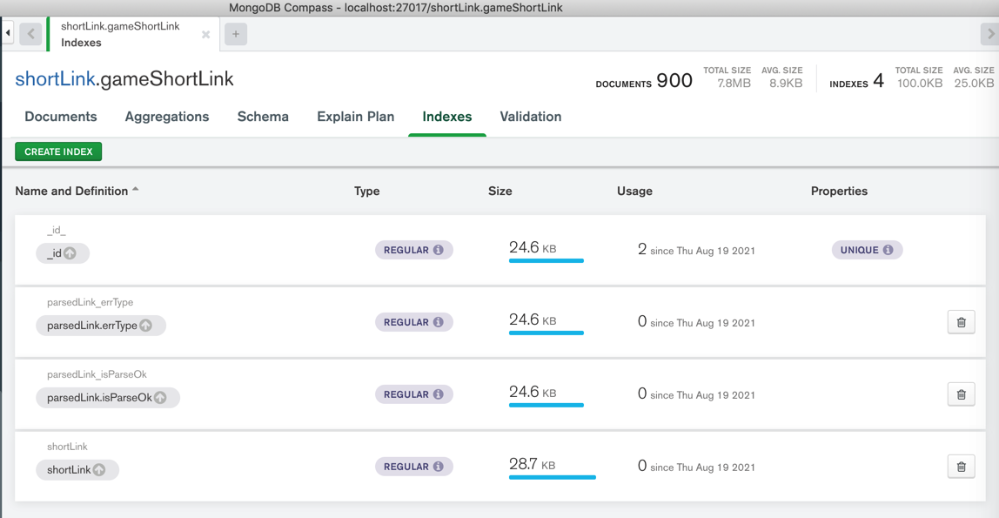

# 删除索引

## mongo shell

```bash
db.gameShortLink.dropIndex({gameShortLink:1})
```

举例：



## MongoDB Compass

MongoDB Compass：

点击索引右边的 垃圾箱的按钮



> #### Note:: 默认`_id`的index无法删除
> 
> `Indexes`中，默认有个`_id`的`index`，是系统自带的，无法删除 -> 所以后面没有垃圾桶按钮 -> 是正常现象。

举例：

一共5个索引：

去删除2个：





还剩3个：


