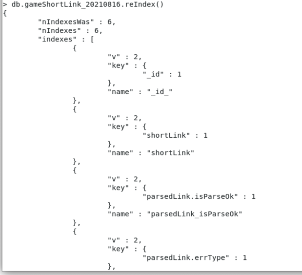
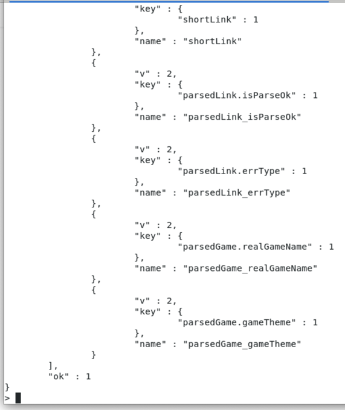

# 重建索引reIndex

## pymongo代码

```python
mongoDb.command({"reIndex": "gameShortLink"})
```

## mongo shell

```bash
db.gameShortLink_20210816.reIndex()
```

举例：





官网文档：

[create_index collection – Collection level operations — PyMongo 3.12.0 documentation](https://pymongo.readthedocs.io/en/stable/api/pymongo/collection.html#pymongo.collection.Collection.create_index)
