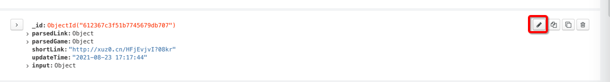
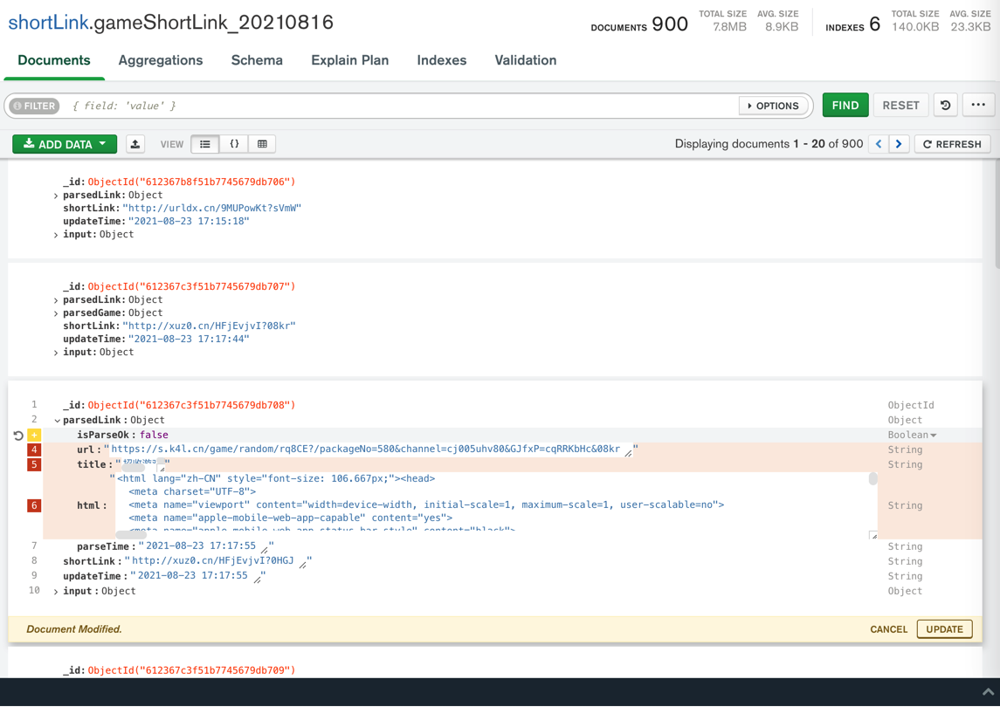

# MongoDB Compass心得

## 好用之处

### 直接编辑内容

截图举例：


### 字段可以很方便的折叠和展开

点击每条记录前面的箭头：


即可展开所有字段：


再次点击，即可缩回。

## 编辑功能很好用

举例：

点击编辑：



或 双击字段的值，即可进入编辑模式

去编辑第三条数据，删除：parsedGame部分

鼠标移动到 改字段前面，点击 x 叉号：


再点击 右下角的 UPDATE，即可删除对应字段。

再去改 parsedLink中的值：

把parsedLink中的isParseOk从`true`，改为`false`

以及删除其他几个字段：



新增字段：

鼠标移动到要加的位置，点击 `加号`=`➕`：


显示`Add Field after isParseOk`，点击


新增了一项：


输入key和value值：

* `errMsg`: `Message: timeout: Timed out receiving message from renderer: 9.224\n  (Session info: headless chrome=92.0.4515.131)\n`
* `errType`: `TIMEOUT`


继续添加其他字段：


点击`UPDATE`：


更新后的字段：


即可。

编辑后的数据的效果：


## MongoDB Compass中拷贝值

点击右上角的 拷贝按钮：


即可拷贝出json数据：

```json
{"_id":{"$oid":"612367c3f51b7745679db708"},"parsedLink":{"isParseOk":false,"errMsg":"Message: timeout: Timed out receiving message from renderer: 9.224\\n  (Session info: headless chrome=92.0.4515.131)\\n","errType":"TIMEOUT","parseTime":"2021-08-23 17:17:55"},"shortLink":"http://xuz0.cn/HFjEvjvI?0HGJ","updateTime":"2021-08-23 17:17:55","input":{"signature":"【招收游戏 托】","smsContent":"【招收游戏 托】南充市违规招您为带区演员，全服横着走！每天5发648！点 xuz0.cn/HFjEvjvI?0HGJ 谨防泄露退订回T","generateDate":"20210816"}}
```

格式化后：

```json
{
  "_id": { "$oid": "612367c3f51b7745679db708" },
  "parsedLink": {
    "isParseOk": false,
    "errMsg": "Message: timeout: Timed out receiving message from renderer: 9.224\\n  (Session info: headless chrome=92.0.4515.131)\\n",
    "errType": "TIMEOUT",
    "parseTime": "2021-08-23 17:17:55"
  },
  "shortLink": "http://xuz0.cn/HFjEvjvI?0HGJ",
  "updateTime": "2021-08-23 17:17:55",
  "input": {
    "signature": "【招收游戏 托】",
    "smsContent": "【招收游戏 托】南充市违规招您为带区演员，全服横着走！每天5发648！点 xuz0.cn/HFjEvjvI?0HGJ 谨防泄露退订回T",
    "generateDate": "20210816"
  }
}
```

后记：放到VSCode，格式化后，效果：


## 其他实际使用效果举例


