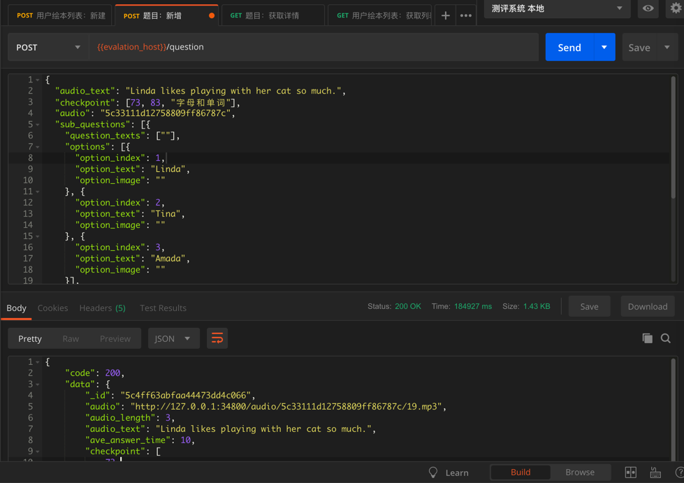
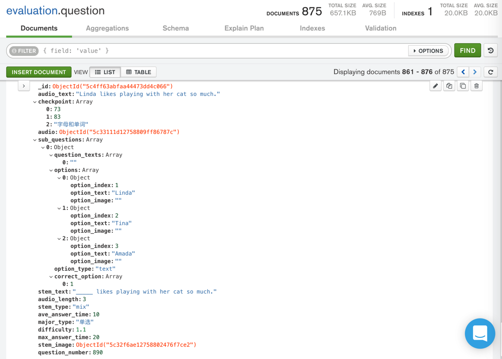

# 插入新增记录

举例：

```python
insertResult = questionCollection.insert_one(newQuestion)
newQuestionIdObj = insertResult.inserted_id
log.debug("newQuestionIdObj=%s", newQuestionIdObj)
```

类似的用Postman通过API调用效果：



插入后的数据在`MongoDB Compass`的显示效果：


