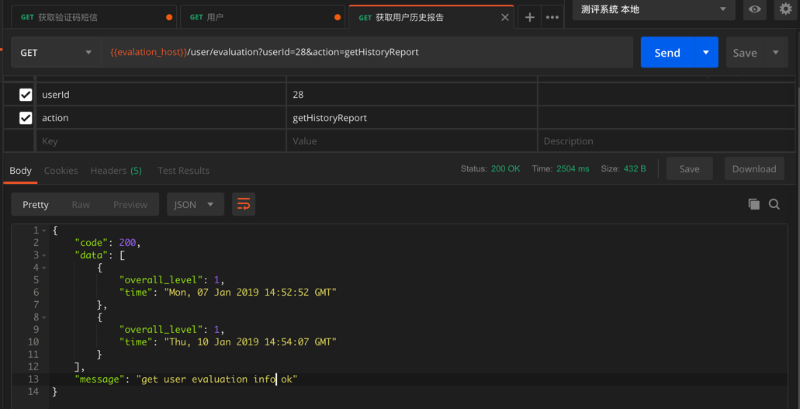

# 设置时间范围等查询条件

代码：

```python
import pymongo
import datetime

curTime = datetime.datetime.now()
# timeKeyName = "start_time"
timeKeyName = "finish_time"
earliestTime = curTime - datetime.timedelta(days = 180)
userEvaluations = evalCollection.find({
    "user_id": userId,
    timeKeyName: {
        "$gte": earliestTime,
        "$lte": curTime
    }
}).sort(timeKeyName, pymongo.DESCENDING).limit(20)
userEvaluationList = list(userEvaluations)
userEvaluationList.reverse()
historyList = []
for eachEvaluation in userEvaluationList:
    if "overall_level" in eachEvaluation:
        curTimeLevelDict = {
            "time": eachEvaluation[timeKeyName],
            "overall_level": eachEvaluation["overall_level"]
        }
        historyList.append(curTimeLevelDict)
log.debug("historyList=%s", historyList)
```

实现了期望的逻辑：

* 去mongodb查询
    * 最早半年前，最晚当前时间
    * 结果中再去根据时间倒序
    * 然后再去取最多20个
        * 从而实现：最近半年，最多20个，只不过顺序是反的而已
* 对于时间倒序后的结果，再调换顺序

即可得到需要的：最近半年的，最多20个，按照时间升序排列

然后输出希望的结果：


