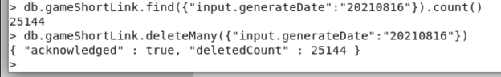

# 删除记录

`mongo shell`：

## 删除多个

全部删除：

```bash
db.collectionName.deleteMany({})
```

删除特定条件的数据：

```bash
db.colelctionName.deleteMany({ fieldName : fieldValue })
```

举例：

```bash
db.inventory.deleteMany({ status : "A" })
```

```bash
db.gameShortLink.deleteMany({"input.generateDate":"20210816"})
```



## 删除单个

```bash
db.colelctionName.deleteOne({ fieldName : fieldValue })
```

举例：

```bash
db.inventory.deleteOne( { status: "D" } )
```

官网文档：

[Delete Documents — MongoDB Manual](https://docs.mongodb.com/manual/tutorial/remove-documents/)
