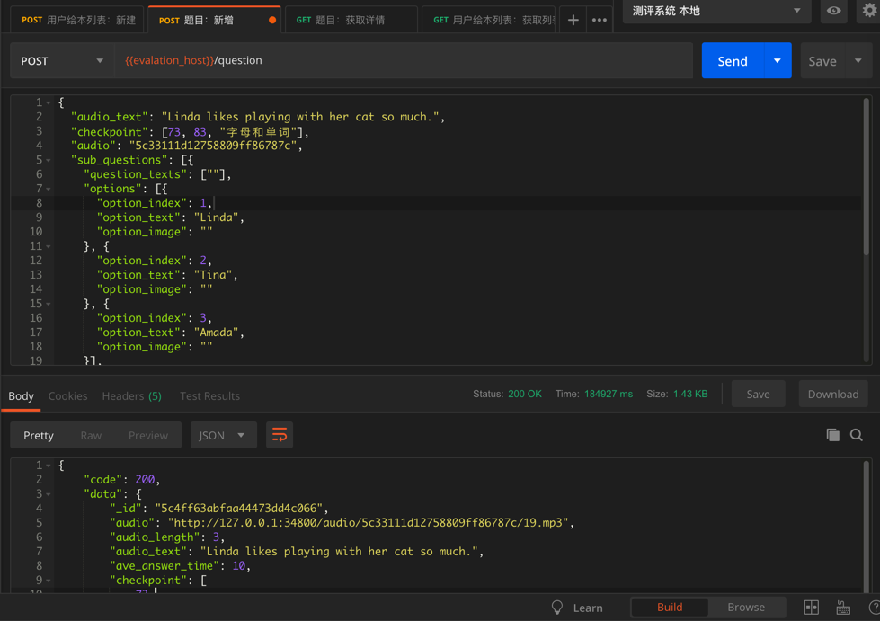
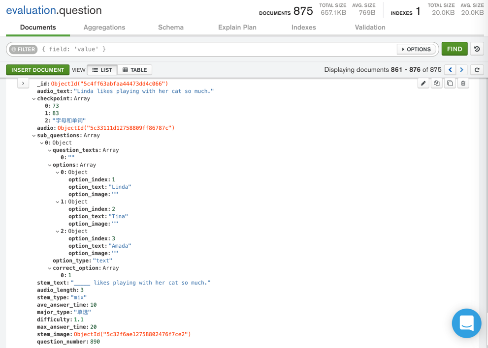

# 新建记录

新建记录 = 插入新数据 = 新增记录

## 代码pymongo

举例：

```python
insertResult = questionCollection.insert_one(newQuestion)
newQuestionIdObj = insertResult.inserted_id
log.debug("newQuestionIdObj=%s", newQuestionIdObj)
```

类似的用Postman通过API调用效果：



插入后的数据在`MongoDB Compass`的显示效果：



## 图形界面工具Mongo Compass

TODO：加用Compass新增数据的例子
