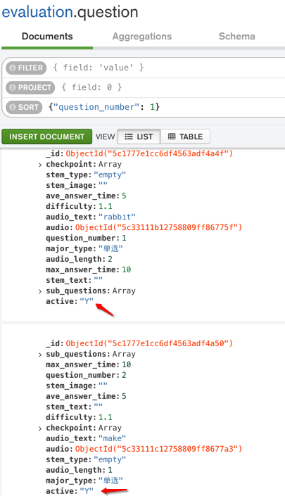

# 如何更新数据

对于已有一个MongoDB的记录，想要去更新其中的部分数据，有如下几种方式：

## MongoDB shell

官网举例

```bash
db.col.update( { "count" : { $gt : 5 } } , { $set : { "test5" : "OK"} },true,true );
```

### 举例：设置active为Y

mongo shell中去插入新字段

```bash
db.question.update({}, {$set: {"active": "Y"}}, {upsert: false, multi: true})
```

输出：

```bash
> db.question.update({}, {$set: {"active": "Y"}}, {upsert: false, multi: true})
WriteResult({ "nMatched" : 883, "nUpserted" : 0, "nModified" : 883 })
```

效果：



## pymongo

通过PyMongo去更新某个记录的部分数据

举例：

```python
        insertResult = mongoDstCollection.insert_one(dstBookInfo)
        logging.debug("insertResult=%s", insertResult)
        newDstRecordId = insertResult.inserted_id
        logging.debug("newDstRecordId=%s", newDstRecordId)
        # update inserted id into existing old source record
        mergedId = ""
        if newDstRecordId:
            mergedId = str(newDstRecordId)
        logging.debug("mergedId=%s", mergedId) # '5bd28426bfaa44216e98a496'
        updateResult = mongoSrcCollection.update_one(filter={"_id": curSrcBookIdOjb}, update={"$set": {"mergedId": mergedId}})
        logging.debug("updateResult=%s", updateResult)
        matched_count = updateResult.matched_count
        modified_count = updateResult.modified_count
        logging.debug("matched_count=%s, modified_count=%s", matched_count, modified_count)
```

## Python

### PyMongo

#### 更新单条数据的整个值

MongoDB中，想要Python的pymongo中，实现（除了_id不变外的）单个项目，单条数据的整个值的替换：

代码：

```python
            mongoCollection.update_one(
                {"_id": oldMongoId},
                {'$set': newValueDict},
                upsert=False,
            )
```

举例：

```python
eachFailedItem = mongoCollectionShortlink.find(queryDict)

oldMongoId = eachFailedItem.pop("_id", None)

mongoCollectionShortlink.update_one(
    {"_id": oldMongoId},
    {'$set': newRespResult},
    upsert=False,
)
```
